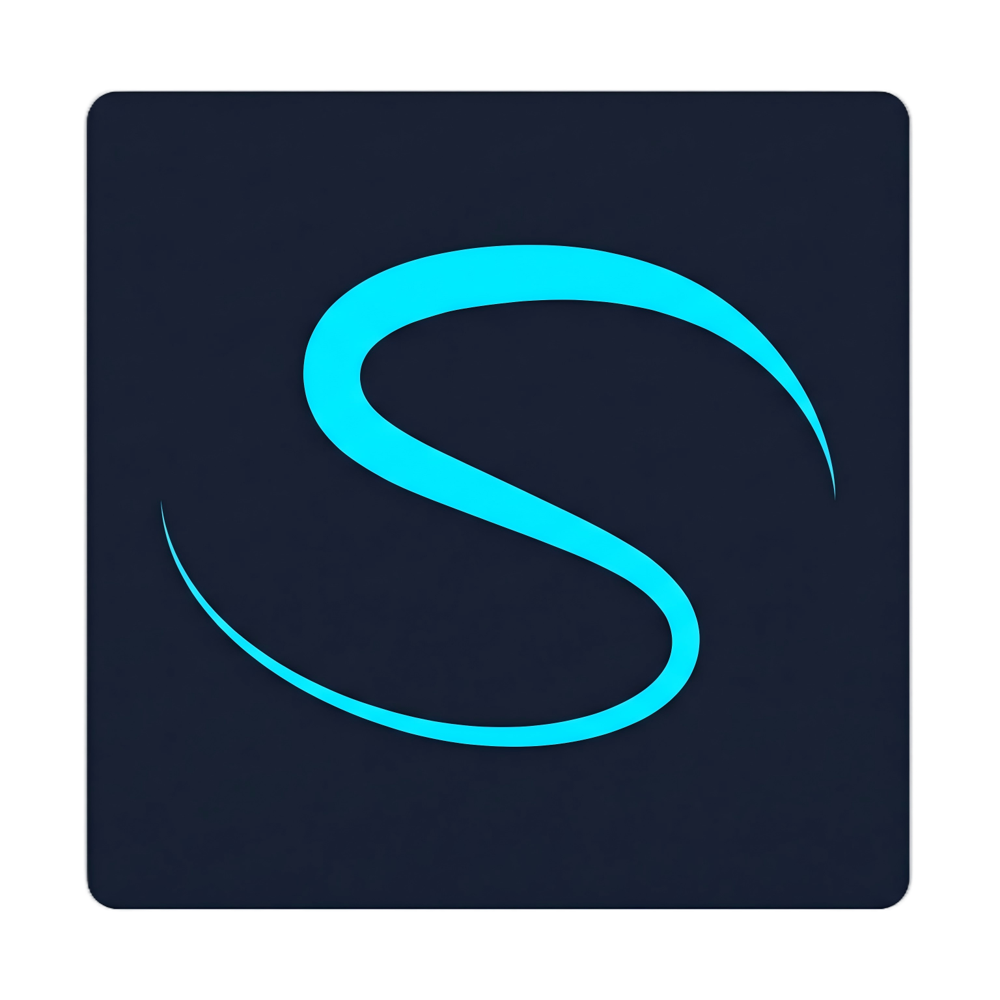

<div align="center">



# SLIM-ARC

### Synergistic LLM Integration with Memory-Aware Runtime Co-Optimization for On-Device Agents

[](LICENSE)
[](https://github.com/Nexa-Language/SLIM-ARC)
[](https://www.sysu.edu.cn/)
[](#核心成果)
[](https://slim.nexa-lang.com)

**让 80B MoE 大模型在 8GB 内存端侧设备上流畅运行**

[架构设计](#系统架构) · [核心成果](#核心成果) · [快速开始](#快速开始) · [实验数据](docs/design/architecture.md) · [论文报告](reports/Competition_Report/main.pdf)

</div>

---

## 项目概述

SLIM-ARC 是 2026 全国大学生系统能力大赛操作系统设计赛 Proj 59 参赛项目，由中山大学"依托Agent答辩OS"团队开发。项目针对**内存受限环境的大语言模型推理优化**问题，通过操作系统级虚拟内存机制与 MoE 稀疏性的深度协同，实现了 80B 参数的 MoE 大模型（Qwen3-Next-80B-A3B，45GB）在 8GB RAM 端侧设备上的可运行乃至流畅推理。

### 核心 Insight

> **MoE 模型的专家稀疏性与操作系统虚拟内存机制的结合，是实现端侧大模型推理的有效路径。**

通过 `posix_madvise(MADV_RANDOM)` 这一标准 POSIX 接口，系统能够精确地只加载被 MoE Router 激活的专家权重（10/512 = 2%），将 45GB 模型的物理内存占用降至接近实际访问量（~2GB），无需复杂的用户态内存管理。

## 核心成果

<div align="center">

| 指标 | 数值 | 说明 |
|:---:|:---:|:---|
| **累计加速** | **64.5×** | 8GB 环境 decode 0.08 → 5.16 t/s |
| **8GB 环境加速** | **+850%** | 0.08 → 0.76 t/s (9.5×) |
| **FlashAttention** | **+71.4%** | 3.01 → 5.16 t/s (零代码改动) |
| **物理内存节省** | **98%** | RSS 45GB → 2GB |
| **GSM8K 精度** | **75%** | Qwen3-4B Q4_K_M (8-shot ALEM) |
| **KV Eviction** | **+9.6%** | 80B decode 3.01 → 3.30 t/s |

</div>

### 优化技术链

```
Baseline (0.08 t/s) → +MADV_RANDOM (0.42) → +KV q4_0 (0.76)
→ +IQ4_XS (2.45) → +FlashAttention (5.16 t/s)
```

## 系统架构

SLIM-ARC 采用三层协同架构：

| 层级 | 职责 | 核心技术 |
|:---|:---|:---|
| **内核协同层** | OS 虚拟内存接口 | mmap + posix_madvise(MADV_RANDOM/WILLNEED/DONTNEED) |
| **运行时调度层** | 动态 I/O 调度 | prefetch_scheduler + MoE Router Hook + unified_io_scheduler |
| **量化优化层** | 算法侧优化 | IQ4_XS 权重 + KV q4_0 + FlashAttention |

详见 [架构文档](docs/design/architecture.md) 和 [核心设计](reports/Competition_Report/sections/03_core_design.pdf)。

## 快速开始

### 环境要求

- **CPU**: x86-64 (AVX2 + AVX_VNNI 推荐)
- **RAM**: 8-32 GB (三档 cgroups 隔离)
- **存储**: NVMe SSD (~3.5 GB/s)
- **OS**: Linux (Ubuntu 22.04 / WSL2)
- **编译器**: GCC 11+, CMake 3.14+

### 构建与运行

```bash
# 1. 克隆仓库
git clone https://github.com/Nexa-Language/SLIM-ARC.git
cd SLIM-ARC

# 2. 克隆 upstream llama.cpp 并应用 SLIM-ARC
git clone https://github.com/ggml-org/llama.cpp src/llama-upstream
python3 scripts/apply-slim-arc.py

# 3. 构建（禁用 repack 避免 OOM）
cd src/llama-upstream
cmake -B build -DGGML_CPU_REPACK=OFF -DCMAKE_BUILD_TYPE=Release
cmake --build build -j$(nproc)

# 4. 运行 80B IQ4_XS（32GB 热缓存，流畅推理）
LD_LIBRARY_PATH=build/bin ./build/bin/llama-cli \
    -m ../../data/models/Qwen3-Next-80B-A3B-Instruct-IQ4_XS.gguf \
    -t 8 -c 256 -ctk q4_0 -ctv q4_0 -fa auto -p "The capital of China is"
```

### 环境变量开关

| 变量 | 作用 |
|:---|:---|
| `SLIM_ARC_DISABLE` | 禁用所有 SLIM-ARC 优化 |
| `SLIM_ARC_NO_MADV_RANDOM` | 不设 MADV_RANDOM |
| `SLIM_ARC_DYNAMIC_MADV` | 启用 prefill/decode 动态切换 |
| `SLIM_ARC_KV_EVICT=1` | 启用 StreamingLLM KV eviction |
| `SLIM_ARC_KV_SINK=4` | attention sink token 数 |
| `SLIM_ARC_KV_WINDOW=1024` | KV 滑动窗口大小 |

## 测试模型

| 模型 | 类型 | 量化 | 大小 | 专家数 | 激活专家 |
|:---|:---|:---|:---|:---:|:---:|
| Qwen3-4B | Dense | Q4_K_M | 2.4 GB | — | — |
| OLMoE-1B-7B | MoE | Q4_K_M | 3.9 GB | 64 | 8 |
| Qwen3-Next-80B | MoE | Q4_K_M | 45.1 GB | 512 | 10 |
| Qwen3-Next-80B | MoE | IQ4_XS | 39.7 GB | 512 | 10 |

## 项目结构

```
SLIM-ARC/
├── src/llama-upstream/       # upstream llama.cpp + SLIM-ARC 修改
│   └── src/slim-arc-*.h/.cpp # SLIM-ARC 独立模块
├── scripts/
│   ├── apply-slim-arc.py     # 幂等集成脚本
│   ├── env/setup-cgroups.sh  # 三档 cgroups 配置
│   └── bench/                # benchmark 脚本
├── docs/
│   ├── design/               # 工程级代码文档
│   └── papers/               # 参考论文
├── reports/Competition_Report/ # 学术报告 (LaTeX + PDF)
├── patches/                  # SLIM-ARC 补丁
├── site/                     # 展示网站 (GitHub Pages)
└── config/                   # 配置文件
```

## 关键技术

- **mmap + MADV_RANDOM**: 利用 OS 虚拟内存按需加载 MoE 激活专家
- **MoE Router Hook**: 提取 `ffn_moe_topk` 张量，跨层预测激活专家
- **FlashAttention**: IO-aware tiling 融合，decode +71.4%
- **StreamingLLM KV Eviction**: sink + sliding window，KV 内存 O(1)
- **KV q4_0 量化**: KV Cache 内存减半，decode +14%
- **IQ4_XS 量化**: 45→40GB，cache 命中率提升

## 相关论文

- [FlexInfer (EuroMLSys'25)](docs/papers/FlexInfer%20Breaking%20Memory%20Constraint...pdf) — 端侧 LLM 权重卸载
- [On-Device LLM Survey (2026)](docs/papers/On-Device%20Large%20Language%20Models...pdf) — 综述
- [StreamingLLM (ICLR'24)](https://arxiv.org/abs/2309.17453) — Attention Sinks
- [FlashAttention (NeurIPS'22)](https://arxiv.org/abs/2205.14135) — IO-aware Attention
- [SolidAttention (FAST'26)](https://www.usenix.org/conference/fast26/presentation/zheng) — SSD-based KV Serving

## 团队

<div align="center">

| 成员 | 角色 |
|:---:|:---|
| **欧阳易芃** | 项目负责人 · 系统优化 |
| **马福泉** | 实验评估 |
| **刘昊** | 文档与展示 |

**指导教师**: 赵帅、张献伟

**中山大学** · 2026 全国大学生系统能力大赛操作系统设计赛 Proj 59

</div>

## License

[MIT License](LICENSE)

## 链接

- 🌐 [展示网站](https://slim.nexa-lang.com)
- 📄 [学术报告 PDF](reports/Competition_Report/main.pdf)
- 🐛 [GitHub Issues](https://github.com/Nexa-Language/SLIM-ARC/issues)
- 🏆 [比赛 GitLab](https://gitlab.eduxiji.net/T2026105589911358/project3136859-389100)

---

<div align="center">

<sub>Built with ❤️ by 依托Agent答辩OS · Powered by OS Virtual Memory × MoE Sparsity</sub>

</div>
