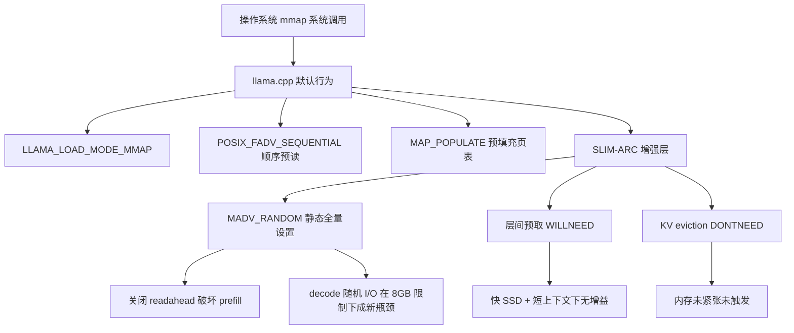

# RK3588 端侧 80B 实验 SLIM-ARC 性能分析

- 日期：2026-08-07（讨论整理）
- 整理人：欧阳易芃
- 关联文档：
  - [`RK3588-SLIMARC-80B测试报告-2026-08-06.md`](RK3588-SLIMARC-80B测试报告-2026-08-06.md)（80B 测试报告）
  - [`RK3588-SLIMARC-80B实验计划.md`](RK3588-SLIMARC-80B实验计划.md)（80B 实验计划）
  - [`RK3588-SLIMARC测试报告-2026-08-05.md`](RK3588-SLIMARC测试报告-2026-08-05.md)（昨日测试报告）
- 数据来源：llama-bench B1-B7 性能矩阵 + madvise LD_PRELOAD 拦截观测

---

## 1. 文档目的

本文档记录对 2026-08-06 完成的 80B 端侧实验数据的三轮技术分析讨论，核心问题是：

> **SLIM-ARC 框架在该实验条件下是否构成负优化？如果是，原因是什么？下一步如何改进？**

三轮分析逐步深入：第一轮做数据归因，第二轮修正"场景匹配性"误判，第三轮从 mmap 机制层面给出根本解释。最终形成可执行的下一步指引。

---

## 2. 实验数据回顾

### 2.1 环境与模型

| 项 | 值 |
|:---|:---|
| 设备 | RK3588 开发板（Orange Pi 5 Plus，8GB RAM） |
| 内存 | 7.8GiB 总 / ~6.1-6.5GiB 可用；Swap 3.9GiB（zram0） |
| 存储 | NVMe SSD，顺序读 **2.1 GB/s** |
| 模型 | Qwen3-Next-80B-A3B-Instruct（MoE，激活约 3B） |
| 量化 | Q4_K_M |
| 体积 | **45.09 GiB**（48,410,988,384 字节） |

### 2.2 B1-B7 性能矩阵（llama-bench，pp/tg，r1 no-warmup）

| 编号 | 配置 | pp (t/s) | tg (t/s) | EXIT |
|:---:|:---|:---:|:---:|:---:|
| B1 | 基线默认（p32 n16 t4，SLIM-ARC 全开） | 0.39 | 0.23 | 0 |
| B2 | `SLIM_ARC_DISABLE=1`（p32 n16 t4） | **2.02** | **0.89** | 0 |
| B3 | `SLIM_ARC_NO_MADV_RANDOM=1`（p32 n16 t4） | 1.41 | 0.65 | 0 |
| B4 | `SLIM_ARC_NO_PREFETCH=1`（p32 n16 t4） | 0.37 | 0.24 | 0 |
| B5 | 长上下文（p64 n32 t4） | 0.55 | 0.30 | 0 |
| B6 | 线程扩展（p32 n16 t8） | 0.89 | 0.48 | 0 |
| B7 | 线程缩减（p32 n16 t2） | 0.23 | 0.17 | 0 |

### 2.3 madvise 拦截观测

采用 LD_PRELOAD 拦截库（`madvise-trace.so`）拦截 `posix_madvise`/`madvise` 系统调用，直接观测 SLIM-ARC 的 madvise 行为。

**默认配置（SLIM-ARC 全开）：**

| advice | 长度 | 调用次数 | 来源 |
|:---|:---|:---:|:---|
| **RANDOM** | 45.1 GiB | 1 | SLIM-ARC MADV_RANDOM 按需分页（`msz > 6GiB` 触发） |
| **WILLNEED** | 45.1 GiB | 1 | mmap 初始预取 / SLIM-ARC 预取 |
| DONTNEED | 6 MiB | 3 | KV cache 页释放 |

**`SLIM_ARC_NO_MADV_RANDOM=1` 配置：**

| advice | 调用次数 |
|:---|:---:|
| RANDOM | **0（消失）** |
| WILLNEED | 1（保留） |
| DONTNEED | 3 |

### 2.4 关键观察

1. **MADV_RANDOM 是主要性能杀手**：B1（全开）vs B3（禁用 RANDOM）—— pp 慢 3.6×（0.39 vs 1.41），tg 慢 2.8×（0.23 vs 0.65）。
2. **预取几乎无影响**：B1（全开）vs B4（禁用预取）—— pp 0.39 vs 0.37，tg 0.23 vs 0.24，差异在噪声范围内。
3. **完全禁用 SLIM-ARC 最快**：B2（DISABLE）pp 2.02、tg 0.89，分别为 B1 的 5.2× 和 3.9×。
4. **线程数影响显著**：t8 > t4 > t2，端侧最优为全核。

---

## 3. 分析一：SLIM-ARC 是否负优化与原因归因

### 3.1 数据结论

在当前测试条件下（冷启动、短生成 -n 16/32、小上下文 -c 256），SLIM-ARC 全开相比完全禁用：

| 指标 | B1（全开） | B2（禁用） | 降幅 |
|:---|:---:|:---:|:---:|
| pp (t/s) | 0.39 | 2.02 | **-80%**（约 5× 慢） |
| tg (t/s) | 0.23 | 0.89 | **-74%**（约 4× 慢） |

**结论：当前测试条件下 SLIM-ARC 全开构成负优化，pp/tg 均下降约 5 倍。**

### 3.2 原因归因（初版）

> ⚠️ 以下为第一轮分析的初步归因，部分判断在第二轮分析中被修正（见 §4）。

1. **MADV_RANDOM 与上游默认 I/O 策略冲突**：llama.cpp 上游默认使用 `POSIX_FADV_SEQUENTIAL` + `MAP_POPULATE`，MADV_RANDOM 会关闭内核 readahead，惩罚 prefill 阶段的顺序访问模式。
2. **decode 加速假设未兑现**：SLIM-ARC 设计假设 MoE 稀疏激活（3-4×）使 decode 阶段受益于随机访问提示，但 45GB 专家页散布在全文件中，逐 token 的随机访问导致缺页更频繁，反而更慢。
3. **预取在快 SSD 上无增益**：SSD 顺序读 2.1GB/s，预取窗口内的数据内核 readahead 已足够覆盖，SLIM-ARC 预取层成为冗余开销。
4. **测试方法学放大劣势**：冷启动（无 warmup）、短生成（16-32 tokens）、小上下文（256）使得 prefill 顺序访问占比极高，恰好放大 MADV_RANDOM 对顺序预读的破坏。

---

## 4. 分析二：关于"场景匹配性"的修正

### 4.1 用户反驳

> "45GB 模型跑在 8GB 上完全符合 SLIM-ARC 的设计目标，内存压力真实存在，不能简单归因为'场景不匹配'。"

### 4.2 确认反驳正确

此反驳成立，理由如下：

- **RSS 峰值 6.29GB < 8GB 是按需分页成功防止 OOM 的证据，而非"问题不存在"**。模型进程 RSS 6.29GB + 系统占用 ~1.4GB ≈ 7.7GB，已逼近 8GB 物理上限。内存压力是真实的。
- 45GB/8GB ≈ 5.6× 的模型/内存比，正是 SLIM-ARC 按需分页机制的设计场景。MADV_RANDOM 的触发条件 `msz > 6GiB` 在此场景下正确触发。

### 4.3 修正后的真正原因

将初版归因中"场景不匹配"的表述修正为更精确的机制层面分析：

1. **核心原因：MADV_RANDOM 静态全量设置**
   - SLIM-ARC 在模型加载时对整个 45.1GiB mmap 区域**一次性、静态**设置 `POSIX_MADV_RANDOM`，不区分 prefill 与 decode 阶段。
   - 这惩罚了 prefill 阶段的顺序访问（关闭 readahead），且 decode 阶段的随机 I/O 在 8GB 物理限制下成为新瓶颈——SSD 随机读远慢于顺序读（2.1GB/s 是顺序读带宽，随机 4K 读 IOPS 低得多）。
   - 设计意图是 prefill 用顺序预读、decode 用随机提示的**动态切换**，但当前未实现。

2. **源码证据：动态切换接口已预留但未实现**

   [`slim-arc-prefetch.cpp:25`](../../patches/llama-upstream/slim-arc-prefetch.cpp:25) 注释明确写道：

   ```cpp
   // SLIM-ARC FIX 2026-08-05: 记录 mmap 区域，供未来动态 MADV 切换使用。
   void register_mmap_region(void * addr, size_t size) {
       std::lock_guard<std::mutex> lk(g_mmap_mtx);
       if (addr && size > 0) {
           g_mmap_regions.emplace_back(addr, size);
       }
   }
   ```

   `register_mmap_region` 仅将区域地址记入 `g_mmap_regions` 向量，**当前仅记录，未实现 prefill→SEQUENTIAL / decode→RANDOM 的动态切换逻辑**。这意味着当前是静态全量 RANDOM，与设计意图存在差距。

3. **预取在快 SSD + 短上下文下无增益**：SSD 顺序读 2.1GB/s，内核 readahead 已足够覆盖预取窗口；短上下文下 decode 步数少，预取的交叉点收益无法体现。

4. **测试方法学掩盖潜在收益**：冷启动、短生成（16-32 tokens）、小上下文（256）使得 prefill 顺序访问占比极高，放大 MADV_RANDOM 的破坏；同时 decode 步数太少，无法体现随机访问提示在长生成稳态下的潜在收益。

### 4.4 归因演进对比

| 维度 | 初版归因（§3.2） | 修正后归因（§4.3） |
|:---|:---|:---|
| 场景判断 | 隐含"场景不匹配" | 场景完全匹配，内存压力真实 |
| MADV_RANDOM | 与上游策略冲突 | 静态全量设置，未实现动态切换（核心） |
| decode 收益 | 假设未兑现 | 8GB 物理限制下随机 I/O 成新瓶颈 |
| 预取 | 快 SSD 无增益 | 快 SSD + 短上下文无增益（不变） |
| 测试方法 | 放大劣势 | 放大劣势 + 掩盖潜在收益 |

---

## 5. 分析三：为何关闭 SLIM-ARC 不 OOM（mmap 机制解释）

### 5.1 核心答案

**llama.cpp 本身内置 mmap 按需分页（`LLAMA_LOAD_MODE_MMAP` 为默认值），SLIM-ARC 是增强层而非开启层。** 关闭 SLIM-ARC 后 mmap 按需分页仍然生效，因此不会 OOM。

### 5.2 源码证据

| 文件 | 行 | 内容 | 说明 |
|:---|:---:|:---|:---|
| [`common.h:475`](../../src/llama-upstream/common/common.h:475) | 475 | `load_mode` 默认 `LLAMA_LOAD_MODE_MMAP` | 加载模式默认 mmap |
| [`llama-model-loader.cpp:550`](../../src/llama-upstream/src/llama-model-loader.cpp:550) | 550 | `use_mmap = true` | 模型加载器默认启用 mmap |
| [`llama-mmap.cpp:451`](../../src/llama-upstream/src/llama-mmap.cpp:451) | 451 | `POSIX_FADV_SEQUENTIAL` | 上游默认顺序预读提示 |
| [`llama-mmap.cpp:455`](../../src/llama-upstream/src/llama-mmap.cpp:455) | 455 | `MAP_POPULATE` | 上游默认预填充页表 |

### 5.3 机制说明

mmap 把 45GB 模型文件映射到进程虚拟地址空间（VmSize 46.6GB），但物理内存按需加载（demand paging）：

- 进程访问某页时触发缺页中断 → 内核从 SSD 读入该页 → 填充物理页帧。
- 未访问的页不占用物理内存，因此 RSS 仅 6.29GB（远小于 45GB）。
- 上游默认的 `POSIX_FADV_SEQUENTIAL` + `MAP_POPULATE` 提供顺序 readahead，优化 prefill 阶段的顺序访问。

### 5.4 三个现象解释

| 现象 | 解释 |
|:---|:---|
| **关闭 SLIM-ARC 不 OOM** | llama.cpp 默认 mmap 按需分页独立生效，RSS 6.26GB < 8GB；SLIM-ARC 不是 OOM 防护的唯一机制 |
| **B2（禁用）prefill 快** | 上游默认 `FADV_SEQUENTIAL` + `MAP_POPULATE` 的顺序 readahead 对 prefill 顺序访问高效；无 MADV_RANDOM 干扰 |
| **B1（全开）prefill 慢** | SLIM-ARC 静态全量 `MADV_RANDOM` 关闭 readahead，破坏 prefill 顺序预读；45GB 文件逐页随机缺页，SSD 随机读远慢于顺序读 |

### 5.5 定位关系图



### 5.6 结论

mmap 按需分页让 45GB 模型"能跑"在 8GB 上，这是 llama.cpp 默认机制。SLIM-ARC 定位为"跑得更快/更省"的行为优化层，但在 45GB/8GB 极端比例下，其 `MADV_RANDOM` 既未带来 decode 收益（随机 I/O 在物理内存限制下更慢），又破坏了 prefill 顺序预读，导致净负优化。

---

## 6. 最终结论与定位

### 6.1 一句话总结

> **不是 SLIM-ARC 救活了 45GB 模型——mmap 按需分页（llama.cpp 默认）才是让它在 8GB 上能跑的机制；SLIM-ARC 是行为优化层，其 MADV_RANDOM 在极端比例下破坏 prefill 顺序预读且未兑现 decode 加速，表现为净负优化。**

### 6.2 实验的三重价值

| 价值 | 说明 |
|:---|:---|
| ① 验证可行性 | 45GB 模型在 8GB 端侧可跑通（EXIT=0，正常输出），mmap 按需分页有效 |
| ② 验证机制触发 | SLIM-ARC MADV_RANDOM 在 >6GB 模型上首次端侧确认触发，开关可控 |
| ③ 暴露问题 | 触发条件过宽（静态全量 RANDOM）+ 动态切换未实现，为改进指明方向 |

### 6.3 逻辑演进图


---

## 7. 下一步指引（可执行）

按优先级排列：

### P0：验证底层 I/O 假设

1. **验证缺页/swap 压力**
   - 工具：`vmstat 1`（观察 `si`/`so` 列）、`/proc/vmstat`（观察 `pgmajfault`）
   - 目标：量化 B1 vs B2 的 major fault 差异，确认 MADV_RANDOM 是否导致更多缺页

2. **测 SSD 随机读 vs 顺序读 IOPS**
   - 工具：`fio --rw=randread --bs=4k` vs `--rw=read --bs=1m`
   - 目标：量化随机 4K 读与顺序读的带宽比，验证"随机 I/O 成新瓶颈"假设

### P1：复测设计目标场景

3. **长生成 + 大上下文复测**
   - 命令：`llama-bench -n 128/256 -c 4096/8192`，对比 B1/B2
   - 目标：验证 decode 稳态下 MADV_RANDOM 是否有收益（短生成无法体现）

4. **验证预取稳态收益**
   - 方法：长生成场景下对比 B1（预取开）vs B4（预取关），寻找 decode 交叉点
   - 目标：确认预取在足够长生成下是否有稳态增益

### P2：机制改进验证

5. **动态 MADV 阶段切换对照实验**
   - 方案：prefill 阶段用 `POSIX_MADV_SEQUENTIAL`，decode 阶段切换为 `POSIX_MADV_RANDOM`
   - 依据：[`register_mmap_region`](../../patches/llama-upstream/slim-arc-prefetch.cpp:25) 预留接口的设计意图
   - 目标：验证动态切换能否同时保住 prefill 顺序预读 + decode 随机提示

6. **细分消融实验**
   - 方案：仅 MADV_RANDOM（禁预取）vs 仅预取（禁 MADV）vs 两者均开
   - 目标：精确量化各子机制的独立贡献

---

## 8. 附录

### 8.1 术语表

| 术语 | 含义 |
|:---|:---|
| mmap | 内存映射文件，将文件映射到虚拟地址空间，按需分页加载物理内存 |
| demand paging | 按需分页，访问时才触发缺页中断加载物理页 |
| MADV_RANDOM | `posix_madvise` 提示，告知内核该区域将随机访问，关闭 readahead |
| MADV_WILLNEED | `posix_madvise` 提示，告知内核该区域即将访问，触发预读 |
| POSIX_FADV_SEQUENTIAL | `posix_fadvise` 提示，告知内核将顺序访问，增大 readahead 窗口 |
| MAP_POPULATE | `mmap` 标志，预填充页表（不预读数据，但建立页表映射） |
| RSS | Resident Set Size，进程驻留物理内存大小 |
| pp | prompt processing（prefill）吞吐量，tokens/s |
| tg | text generation（decode）吞吐量，tokens/s |
| TTFT | Time To First Token，首 token 延迟 |

### 8.2 数据文件索引

| 文件 | 内容 |
|:---|:---|
| `raw-80b-bench-b1.txt` ~ `-b7.txt` | B1-B7 性能矩阵原始日志 |
| `madvise-trace-default.txt` | 默认配置 madvise 拦截记录 |
| `madvise-trace-nomadv.txt` | NO_MADV_RANDOM 配置 madvise 拦截记录 |
| `rss-peak-smoke-default.txt` | 默认配置 RSS 峰值 |
| `rss-peak-smoke-disable.txt` | 禁用配置 RSS 峰值 |
| `ssd-bw-test.txt` | SSD 带宽实测 |
| `bench-matrix-summary.txt` | 矩阵汇总 |

---

*本文档为技术分析讨论整理，不含实验执行记录。所有数据引用自 2026-08-06 测试报告，源码引用基于 SLIM-ARC 补丁树。*
