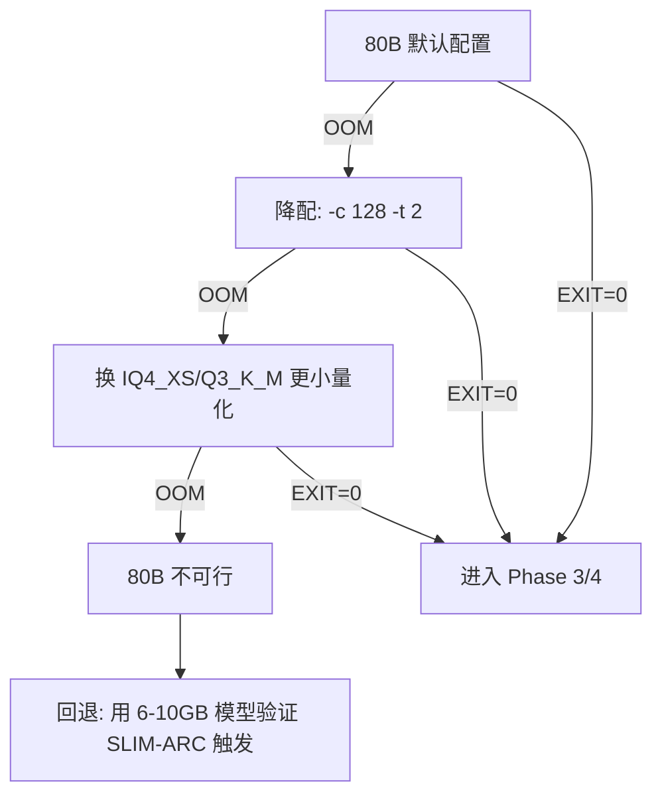
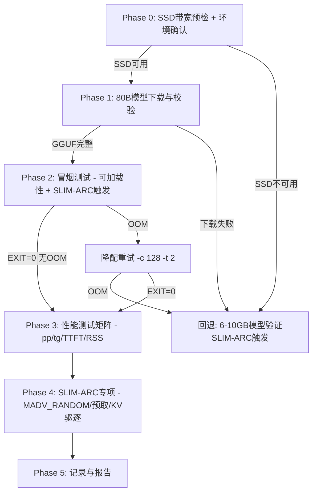

# RK3588 SLIM-ARC 80B 大模型实验计划

- 日期：2026-08-06（起草）
- 项目负责人：欧阳易芃
- 目标设备：RK3588 开发板（Orange Pi 5 Plus，8GB RAM，型号 NBSXNXW23 2516）
- 依据：[`RK3588-SLIMARC测试报告-2026-08-05.md`](RK3588-SLIMARC测试报告-2026-08-05.md) 昨日实验结论
- 文档性质：**实验计划（待执行）**，不含任何已执行命令或实测数据

---

## 0. 背景与动机

### 0.1 昨日结论回顾

昨日（2026-08-05）在 RK3588 端侧完成了 SLIM-ARC 补丁版 llama.cpp 的编译验收与小模型（Qwen3-4B Q4_K_M、OLMoE-1B-7B Q4_K_M）测试。核心结论：

1. 编译通过（EXIT=0），`llama-cli` / `llama-bench` 产物可用。
2. Qwen3-4B decode ~7 t/s；OLMoE-1B-7B decode ~10.7 t/s；FlashAttention 开启 decode 约 2× 提升。
3. **SLIM-ARC 核心创新（>6GB 模型按需分页 / MADV_RANDOM）未触发**：4B（2.32GiB）与 OLMoE（4.21GiB）均 < 6GB 阈值，[`apply-slim-arc.py`](../../scripts/apply-slim-arc.py:95) 中 MADV_RANDOM 条件 `msz > (6ULL << 30)` 不满足。
4. **80B（Qwen3-Next-80B，~40GiB）因 microSD 仅剩 17GiB 判定"不可行"**，无实测数据。

### 0.2 今日关键变化

- **SSD 已挂载**到 `/home/orangepi/ssd`（ext4，约 234G 可用），存储容量瓶颈解除。
- 80B 模型（~40-50GiB GGUF）可完整存放于 SSD，且 40GiB >> 6GB 阈值，**SLIM-ARC 按需分页首次具备端侧触发条件**。
- SSD 具体读写带宽尚未实测（需 Phase 0 预检）。

### 0.3 本次实验的核心定位

> **SSD 就位后，80B 模型在 8GB 内存 RK3588 端侧能否运行？SLIM-ARC 按需分页在 >6GB 模型上是否触发并生效？**

这是 SLIM-ARC 项目在真实端侧（非主机/WSL cgroup 模拟）场景下首次验证核心机制的机会。

---

## 1. 实验目标

| 编号 | 核心问题 | 验证方式 |
|:---:|:---|:---|
| G1 | 80B 模型（~40-50GiB GGUF）能否在 8GB 内存 RK3588 上通过 mmap 加载并完成推理？ | llama-cli 加载 + 生成短文本，观察是否 OOM / 是否正常输出 |
| G2 | SLIM-ARC MADV_RANDOM 按需分页是否在 >6GB 模型上触发？ | 观察日志 / strace / 行为差异（prefill 变慢、decode 受益） |
| G3 | SLIM-ARC 预取调度器（prefetch_scheduler）是否启用并工作？ | `model_fits=false` → `should_enable=true`；对比 `SLIM_ARC_DISABLE=1` 基线 |
| G4 | 端侧 80B 推理性能（pp / tg / 首 token 延迟 / RSS）如何？ | llama-bench + llama-cli 多配置矩阵 |
| G5 | SSD 带宽对端侧大模型推理的影响有多大？ | 实测 SSD 带宽 + 关联推理吞吐分析 |

### 1.1 SLIM-ARC 触发条件技术确认

基于 [`apply-slim-arc.py`](../../scripts/apply-slim-arc.py) 源码分析：

| 机制 | 触发条件 | 80B 预期 |
|:---|:---|:---:|
| **MADV_RANDOM** | `!SLIM_ARC_DISABLE && !SLIM_ARC_NO_MADV_RANDOM && msz > 6GiB && addr 有效`（[行 95](../../scripts/apply-slim-arc.py:95)） | ✅ 触发（40GiB >> 6GiB） |
| **prefetch_scheduler** | `!SLIM_ARC_DISABLE && !SLIM_ARC_NO_PREFETCH && !model_fits`（[行 126-128](../../scripts/apply-slim-arc.py:126)） | ✅ 触发（`model_fits = 40GB < 8GB×60%=4.8GB` = false） |
| **memory_budget** | `total_weight_size > 6GiB` 时设为权重总大小（[行 134](../../scripts/apply-slim-arc.py:134)） | ✅ 设为 ~40GB |
| **KV eviction** | `SLIM_ARC_KV_EVICT=1` 显式开启 | 手动开启 |

> **注意**：`model_fits` 读取 `/sys/fs/cgroup/memory.max`。RK3588 无 root 无法创建子 cgroup，`memory.max` 可能为系统总量（~8GB）或 "max"（无限制）。两种情况下 80B 均 `model_fits=false`，预取均会启用。

---

## 2. 风险与可行性分析

### 2.1 内存风险（最高风险）

| 风险 | 分析 | 缓解 |
|:---|:---|:---|
| **OOM Kill** | 8GB 物理内存 vs 40GiB 权重，操作系统 mmap 按需调页理论上可行，但 KV cache + 运行时开销 + 其他进程可能触发 OOM | 用小上下文（`-c 512` 甚至 `-c 256`）控制 KV cache；关闭其他进程；监控 `dmesg` |
| **Swap 风暴** | zram0 仅 3.9GiB swap，若内核将权重页换出到 zram 会极度缓慢 | MADV_RANDOM 应避免 readahead，但无法阻止 swap-out；监控 `vmstat`/`si so` |
| **RSS 峰值不可控** | 无 root 无法 cgroup 限内存 | 仅能观察记录，无法强制约束 |

### 2.2 存储带宽风险

| 风险 | 分析 | 缓解 |
|:---|:---|:---|
| **SSD 带宽未知** | 昨日 microSD 仅 68.6MB/s 是瓶颈；SSD 带宽尚未实测 | Phase 0 必须先测（dd / hdparm / fio） |
| **decode 受 I/O 限制** | 80B 每生成 1 token 需按需读取权重页，若 SSD 带宽不足则 decode 极慢 | 设现实性能预期（见 §7）；MADV_RANDOM 的价值正在于此场景 |

### 2.3 算力风险

| 风险 | 分析 | 缓解 |
|:---|:---|:---|
| **ARM 无 AVX2/SVE/i8mm** | 端侧 80B decode 预计极慢（参考主机 x86 8GB 场景 80B IQ4_XS 仅 0.08-0.76 t/s） | 设宽松时间预算；优先测短生成（`-n 16/32`） |
| **prefill 极慢** | MADV_RANDOM 关闭 readahead，prefill 需逐页随机读，可能比 microSD 顺序读更慢 | 分开测 pp 和 tg；记录加载耗时 |

### 2.4 可行性判断

| 维度 | 昨日 | 今日 | 结论 |
|:---|:---|:---|:---|
| 存储容量 | ❌ 17GiB < 40GiB | ✅ 234GiB SSD | **容量可行** |
| 存储带宽 | ❌ 68.6MB/s microSD | ❓ SSD 待测 | **Phase 0 决定** |
| 内存 | ⚠️ 8GB vs 40GiB | ⚠️ 同左 | **依赖 mmap+分页，高风险** |
| 算力 | ⚠️ ARM 无 AVX2 | ⚠️ 同左 | **性能极慢但可测** |

**总体判断**：容量瓶颈已解除，具备实验条件；但性能预期必须现实——端侧 80B 推理可能极慢（< 1 t/s），实验目标以"验证可运行性 + SLIM-ARC 触发"为主，性能数据为辅。

---

## 3. 前置准备（Phase 0）

### 3.1 SSD 带宽实测

```bash
# 顺序写带宽（写入 ~4GB 测试文件）
dd if=/dev/zero of=/home/orangepi/ssd/.bwtest bs=1M count=4096 oflag=direct status=progress

# 顺序读带宽（清缓存后读回）
dd if=/home/orangepi/ssd/.bwtest of=/dev/null bs=1M status=progress

# 若 hdparm 可用
sudo hdparm -tT /dev/nvme0n1   # 设备名需确认

# 记录到 docs/rk3588_test_notes/ssd-bw-test.txt
```

> **判定标准**：SSD 顺序读 > 200MB/s 为"可用"；< 100MB/s 则 80B 端侧推理可能不可接受。

### 3.2 环境与工具链确认

| 检查项 | 命令 | 预期 |
|:---|:---|:---|
| llama-cli 产物 | `ls -la SLIM-ARC/src/llama-upstream/build/bin/llama-cli` | 存在且可执行 |
| llama-bench 产物 | `ls -la SLIM-ARC/src/llama-upstream/build/bin/llama-bench` | 存在且可执行 |
| SLIM-ARC 符号 | `nm -D SLIM-ARC/src/llama-upstream/build/libllama.so \| grep prefetch` | `slim_arc::prefetch_scheduler::*` 等符号存在 |
| SSD 挂载 | `df -h /home/orangepi/ssd` | ext4，~234G 可用 |
| 可用内存 | `free -h` | ~6.6GiB 可用 |
| 网络通道 | `curl -sI https://hf-mirror.com` | 200 OK |

### 3.3 模型存放路径规划

- 模型 GGUF 文件存放：`/home/orangepi/ssd/models/`
- 下载临时文件：`/home/orangepi/ssd/downloads/`
- 日志输出：`SLIM-ARC/docs/rk3588_test_notes/`（与昨日报告同目录）

---

## 4. 模型选型与量化建议

### 4.1 首选模型

| 模型 | 量化 | 预估体积 | 来源 | 说明 |
|:---|:---|:---:|:---|:---|
| **Qwen3-Next-80B** | Q4_K_M | ~40-50GiB | `hf-mirror.com` | 昨日计划模型，MoE 架构，SLIM-ARC 对 MoE 有专家预取优化 |

### 4.2 量化策略

| 量化 | 体积估算 | 适用性 | 备注 |
|:---|:---:|:---|:---|
| Q4_K_M | ~40-50GiB | ✅ 首选 | 与昨日 4B/OLMoE 一致，便于对标 |
| IQ4_XS | ~42GiB | 备选 | 主机报告显示 IQ4_XS 在 80B 上表现好，但 ARM 无 i8mm 可能反量化慢 |
| Q3_K_M | ~35GiB | 备选 | 更小体积降低 I/O，但精度损失 |

> **建议**：优先 Q4_K_M（与昨日小模型量化一致，便于横向对标）。若 GGUF 不可用则考虑 IQ4_XS。

### 4.3 下载源与方式

```bash
# 使用 hf-mirror.com 镜像
export HF_ENDPOINT=https://hf-mirror.com

# 方式一：huggingface-cli（若已安装）
huggingface-cli download Qwen/Qwen3-Next-80B-A3B-Instruct-GGUF \
  --local-dir /home/orangepi/ssd/models/qwen3-next-80b-q4km \
  --local-dir-use-symlinks False

# 方式二：wget 直拉单文件（需确认 GGUF 文件名）
wget -c https://hf-mirror.com/Qwen/Qwen3-Next-80B-A3B-Instruct-GGUF/resolve/main/qwen3-next-80b-q4_k_m.gguf \
  -O /home/orangepi/ssd/models/qwen3-next-80b-q4km.gguf
```

> **注意**：80B 是 MoE 模型（Qwen3-Next-80B-A3B，激活 3B），昨日 OLMoE 已验证 MoE 专家预取调用链安全。若 Qwen3-Next-80B GGUF 不存在，备选其他 80B 级 GGUF 模型。

### 4.4 模型完整性校验

```bash
# 校验文件大小与 SHA256（如有官方校验值）
sha256sum /home/orangepi/ssd/models/qwen3-next-80b-q4km.gguf

# 用 llama-cli --help 确认可识别
SLIM-ARC/src/llama-upstream/build/bin/llama-cli \
  -m /home/orangepi/ssd/models/qwen3-next-80b-q4km.gguf \
  -p "hi" -n 1 --no-cnv 2>&1 | head -20
```

---

## 5. 实验步骤（分阶段）

### Phase 0：环境与带宽预检

| 步骤 | 内容 | 产出 |
|:---:|:---|:---|
| 0.1 | SSD 读写带宽实测（见 §3.1） | `ssd-bw-test.txt` |
| 0.2 | 工具链产物确认（见 §3.2） | `env-check-80b.txt` |
| 0.3 | 可用内存 / swap 状态快照 | `free -h` 输出存档 |
| 0.4 | SSD 挂载与容量确认 | `df -h` 输出存档 |

**Phase 0 准入条件**：SSD 顺序读 > 100MB/s 且 llama-cli/llama-bench 产物可用。

### Phase 1：模型下载与校验

| 步骤 | 内容 | 产出 |
|:---:|:---|:---|
| 1.1 | 从 hf-mirror.com 下载 80B GGUF 到 SSD | `download-80b.log` |
| 1.2 | SHA256 校验（如有官方值） | 校验结果 |
| 1.3 | `llama-cli -m ... -p "hi" -n 1` 确认 GGUF 可被识别 | `model-verify-80b.txt` |

**Phase 1 准入条件**：GGUF 文件完整且可被 llama.cpp 识别。

### Phase 2：冒烟测试（可加载性 + SLIM-ARC 触发确认）

| 步骤 | 命令要点 | 验证点 |
|:---:|:---|:---|
| 2.1 | `llama-cli -m <80B> -p "Hello" -n 16 -c 256 -t 4` | 能否加载？是否 OOM？是否生成输出？ |
| 2.2 | 同上 + `SLIM_ARC_DISABLE=1` | 基线对比：禁用 SLIM-ARC 后是否仍可运行？ |
| 2.3 | 同上 + `SLIM_ARC_NO_MADV_RANDOM=1` | 仅禁用 MADV_RANDOM，保留预取 |
| 2.4 | 监控 RSS 峰值（`monitor-peak-rss.sh` 或 `/usr/bin/time -v`） | RSS 是否在 8GB 以内？ |

```bash
# 冒烟测试模板
BIN=SLIM-ARC/src/llama-upstream/build/bin/llama-cli
MODEL=/home/orangepi/ssd/models/qwen3-next-80b-q4km.gguf

# 2.1 默认（SLIM-ARC 全开）
/usr/bin/time -v $BIN -m $MODEL -p "Hello, how are you?" -n 16 -c 256 -t 4 \
  2>&1 | tee raw-80b-smoke-default.txt

# 2.2 禁用 SLIM-ARC
SLIM_ARC_DISABLE=1 /usr/bin/time -v $BIN -m $MODEL -p "Hello" -n 16 -c 256 -t 4 \
  2>&1 | tee raw-80b-smoke-disable.txt

# 2.3 仅禁用 MADV_RANDOM
SLIM_ARC_NO_MADV_RANDOM=1 /usr/bin/time -v $BIN -m $MODEL -p "Hello" -n 16 -c 256 -t 4 \
  2>&1 | tee raw-80b-smoke-nomadv.txt
```

**Phase 2 准入条件**：至少默认配置能完成加载并生成输出（EXIT=0），无 OOM。

### Phase 3：性能测试矩阵

#### 3.1 llama-bench 矩阵

| 配置编号 | -p | -n | -c | -t | 环境变量 | 目的 |
|:---:|:---:|:---:|:---:|:---:|:---|:---|
| B1 | 32 | 16 | 256 | 4 | 默认（SLIM-ARC 全开） | 基线性能 |
| B2 | 32 | 16 | 256 | 4 | `SLIM_ARC_DISABLE=1` | 禁用 SLIM-ARC 对比 |
| B3 | 32 | 16 | 256 | 4 | `SLIM_ARC_NO_MADV_RANDOM=1` | MADV_RANDOM 消融 |
| B4 | 32 | 16 | 256 | 4 | `SLIM_ARC_NO_PREFETCH=1` | 预取消融 |
| B5 | 64 | 32 | 512 | 4 | 默认 | 更长上下文 |
| B6 | 32 | 16 | 256 | 8 | 默认 | 线程扩展（全核） |
| B7 | 32 | 16 | 256 | 2 | 默认 | 线程缩减 |

```bash
BIN=SLIM-ARC/src/llama-upstream/build/bin/llama-bench
MODEL=/home/orangepi/ssd/models/qwen3-next-80b-q4km.gguf

# B1: 基线
$BIN -m $MODEL -p 32 -n 16 -c 256 -t 4 2>&1 | tee raw-80b-bench-b1.txt

# B2: SLIM-ARC 禁用
SLIM_ARC_DISABLE=1 $BIN -m $MODEL -p 32 -n 16 -c 256 -t 4 2>&1 | tee raw-80b-bench-b2.txt

# ... 依此类推
```

#### 3.2 llama-cli 首 token 延迟测试

```bash
# 测量首 token 延迟（昨日未测，本次补上）
# 使用 -n 1 仅生成 1 token，测量从启动到首 token 的时间
/usr/bin/time -v $BIN -m $MODEL -p "Explain quantum computing in one sentence." \
  -n 1 -c 256 -t 4 --no-cnv 2>&1 | tee raw-80b-ttft.txt
```

> **首 token 延迟** = 加载耗时 + prefill 耗时 + 首 decode 耗时。需从时间戳或 `--verbose` 输出中分离。

#### 3.3 加载耗时测量

```bash
# 单独测量模型加载时间（-n 0 不生成）
/usr/bin/time -v $BIN -m $MODEL -p "" -n 0 -c 256 -t 4 2>&1 | tee raw-80b-load-only.txt
```

### Phase 4：SLIM-ARC 专项验证

#### 4.1 MADV_RANDOM 触发确认

| 验证手段 | 方法 | 预期 |
|:---|:---|:---|
| 行为差异 | 对比 B1（MADV_RANDOM on）vs B3（off）的 pp/tg | MADV_RANDOM on：pp 更慢（无 readahead）、tg 可能更快（按需分页减少争用） |
| strace | `strace -e trace=madvise -f $BIN ...` 2>&1 \| grep MADV_RANDOM | 应看到 `madvise(..., MADV_RANDOM)` 系统调用 |
| 日志 | 观察 stderr 中是否有 SLIM-ARC 相关输出 | 视编译时日志级别而定 |

#### 4.2 预取调度器验证

| 验证手段 | 方法 | 预期 |
|:---|:---|:---|
| 行为差异 | 对比 B1（预取 on）vs B4（预取 off） | 预取 on：decode 可能更快（权重页提前调入） |
| strace | `strace -e trace=madvise -f $BIN ...` 2>&1 \| grep WILLNEED | 应看到 `madvise(..., MADV_WILLNEED)` 预取调用 |

#### 4.3 KV Eviction 验证（可选）

```bash
# 若基础测试通过且内存紧张，测试 KV eviction
SLIM_ARC_KV_EVICT=1 $BIN -m $MODEL -p "Long prompt..." -n 64 -c 1024 -t 4 \
  2>&1 | tee raw-80b-kv-evict.txt
# 预期：日志出现 "SLIM-ARC KV eviction: ENABLED"，seq_len 超阈值后逐 token 驱逐
```

#### 4.4 对比矩阵汇总

| 对比组 | 变量 | 核心观察 |
|:---|:---|:---|
| B1 vs B2 | SLIM-ARC 整体开关 | SLIM-ARC 是否带来净收益 |
| B1 vs B3 | MADV_RANDOM 开关 | 按需分页对 pp/tg 的影响 |
| B1 vs B4 | 预取开关 | 预取对 decode 的加速 |
| B1 vs B6 vs B7 | 线程数 | 端侧最优线程配置 |

### Phase 5：记录与报告

| 步骤 | 内容 |
|:---:|:---|
| 5.1 | 汇总所有 raw-80b-*.txt 原始日志 |
| 5.2 | 整理性能数据表格（pp / tg / RSS / 加载耗时 / 首 token 延迟） |
| 5.3 | 撰写测试报告（命名见 §9） |
| 5.4 | 更新 SLIM-ARC 项目文档中端侧验证状态 |

---

## 6. 指标定义

| 指标 | 缩写 | 单位 | 测量方式 | 昨日对标 |
|:---|:---|:---:|:---|:---|
| Prompt 处理吞吐 | pp | t/s | llama-bench `-p` 列 | 4B: 8.57 t/s |
| Token 生成吞吐 | tg | t/s | llama-bench `-n` 列 | 4B: 6.90 t/s |
| 首 token 延迟 | TTFT | s | llama-cli 时间戳 / `--verbose` | 昨日未测，本次补上 |
| RSS 峰值 | RSS | GB | `/usr/bin/time -v` Maximum resident set size | 4B: ~2.65GB |
| 模型加载耗时 | load | s | 启动到可推理的时间 | 4B: ~9s |
| SSD 顺序读带宽 | BW_seq | MB/s | dd / hdparm | microSD: 68.6MB/s |
| SSD 顺序写带宽 | BW_write | MB/s | dd | — |

> **关键新增指标**：首 token 延迟（TTFT）——昨日报告未测，本次必须补上。对端侧大模型场景，TTFT 是用户体验的关键指标。

---

## 7. 预期与验收标准

### 7.1 验收标准

| 等级 | 标准 | 说明 |
|:---:|:---|:---|
| **S（完全成功）** | 80B 默认配置完成推理输出 + SLIM-ARC MADV_RANDOM 确认触发 + 预取确认启用 + 无 OOM + 完整性能数据 | 核心目标全部达成 |
| **A（基本成功）** | 80B 默认配置完成推理输出 + SLIM-ARC 至少一项机制确认触发 + 无 OOM | 核心可运行性验证达成 |
| **B（部分成功）** | 80B 可加载但推理极慢/超时，或需降量化/降上下文才能运行 | 记录瓶颈数据，有分析价值 |
| **C（失败但有价值）** | 80B 无法加载（OOM），但记录了失败模式与原因 | 触发回退方案（§8） |

### 7.2 现实性能预期

基于主机 x86 数据（SLIM-ARC 报告图表）外推到 ARM 端侧：

| 指标 | 主机 x86 8GB 参考 | RK3588 ARM 预期 | 依据 |
|:---|:---:|:---:|:---|
| tg（decode） | 0.08-0.76 t/s | **< 0.5 t/s**（可能 < 0.1 t/s） | ARM 无 AVX2，算力约为 x86 的 1/3-1/5；且 I/O 受限 |
| pp（prefill） | — | **极慢**，可能以分钟计 | MADV_RANDOM 关闭 readahead，逐页随机读 |
| TTFT | — | **可能 > 60s** | 加载 + prefill 均受 I/O 限制 |
| RSS 峰值 | — | **< 7GB**（否则 OOM） | 8GB 总内存 - 系统开销 |

> **时间预算**：单次冒烟测试（`-n 16`）允许最长 30 分钟；性能矩阵单组允许最长 60 分钟。若超时则记录超时并继续下一组。

### 7.3 关键判定逻辑

```
若 80B 默认配置 EXIT=0 且有输出 → 进入 Phase 3/4 性能与专项测试
若 80B 默认配置 OOM → 尝试 -c 128 / -t 2 降配重试
若 80B 降配仍 OOM → 进入回退方案（§8）
```

---

## 8. 回退方案

### 8.1 回退触发条件

- 80B 模型无法加载（OOM Kill）
- 80B 模型可加载但推理完全无响应（> 60 分钟无输出）
- 80B GGUF 文件无法获取（hf-mirror.com 无该模型）

### 8.2 回退路径



### 8.3 回退模型选型（验证 SLIM-ARC 触发逻辑）

若 80B 完全不可行，需一个 **> 6GB 但 < 8GB** 的模型来触发 MADV_RANDOM（`msz > 6GiB`）：

| 备选模型 | 量化 | 预估体积 | 说明 |
|:---|:---|:---:|:---|
| Qwen2.5-14B | Q4_K_M | ~8-9GiB | 可能略超 8GB，需小上下文 |
| Qwen2.5-7B | Q5_K_M | ~5.5GiB | 可能不触发 6GB 阈值 |
| Llama-3-8B | Q4_K_M | ~4.9GiB | 不触发，仅作对照 |
| **自定义大 GGUF** | — | ~7GiB | 拼接/选择合适模型使体积 > 6GiB |

> **回退目标**：即使 80B 不可行，也要找到一个 > 6GB 的模型验证 SLIM-ARC MADV_RANDOM 在端侧的触发行为，填补昨日报告 §7 的空白。

---

## 9. 文档产出

### 9.1 原始日志命名规范

延续昨日 `raw-*.txt` 风格：

| 阶段 | 日志文件名 |
|:---|:---|
| Phase 0 | `ssd-bw-test.txt`、`env-check-80b.txt` |
| Phase 1 | `download-80b.log`、`model-verify-80b.txt` |
| Phase 2 | `raw-80b-smoke-default.txt`、`raw-80b-smoke-disable.txt`、`raw-80b-smoke-nomadv.txt` |
| Phase 3 | `raw-80b-bench-b1.txt` ~ `raw-80b-bench-b7.txt`、`raw-80b-ttft.txt`、`raw-80b-load-only.txt` |
| Phase 4 | `raw-80b-strace-madv.txt`、`raw-80b-strace-willneed.txt`、`raw-80b-kv-evict.txt` |

### 9.2 测试报告命名

实验完成后新增报告：

```
SLIM-ARC/docs/rk3588_test_notes/RK3588-SLIMARC-80B测试报告-2026-08-06.md
```

报告应包含：
1. 环境快照（含 SSD 带宽实测数据）
2. 模型信息（名称 / 量化 / 体积 / SHA256）
3. 冒烟测试结果
4. 性能测试矩阵完整数据表
5. SLIM-ARC 专项验证结果（MADV_RANDOM / 预取 / KV eviction）
6. 与昨日 4B/OLMoE 数据的横向对比
7. 结论与限制

### 9.3 更新已有文档

- 更新 [`RK3588-SLIMARC测试报告-2026-08-05.md`](RK3588-SLIMARC测试报告-2026-08-05.md) §7 中"80B 不可行"结论，补充 SSD 就位后的新结论引用。

---

## 10. 实验流程总览



---

## 附录 A：SLIM-ARC 环境变量速查

| 环境变量 | 作用 | 默认 |
|:---|:---|:---:|
| `SLIM_ARC_DISABLE=1` | 完全禁用 SLIM-ARC（基线模式） | 未设置=启用 |
| `SLIM_ARC_NO_MADV_RANDOM=1` | 仅禁用 MADV_RANDOM，保留预取 | 未设置=启用 |
| `SLIM_ARC_NO_PREFETCH=1` | 仅禁用预取，保留 MADV_RANDOM | 未设置=启用 |
| `SLIM_ARC_KV_EVICT=1` | 启用 KV cache 驱逐 | 未设置=禁用 |
| `SLIM_ARC_KV_SINK` | KV 驱逐 sink 大小 | — |
| `SLIM_ARC_KV_WINDOW` | KV 驱逐滑动窗口 | — |

## 附录 B：昨日对标数据速查

| 模型 | 量化 | 体积 | pp (t/s) | tg (t/s) | RSS 峰值 |
|:---|:---|:---:|:---:|:---:|:---:|
| Qwen3-4B | Q4_K_M | 2.32GiB | 8.57 | 6.90 | ~2.65GB |
| OLMoE-1B-7B | Q4_K_M | 4.21GiB | 4.3 | 10.7 | ~4.2GB |
| Qwen3-Next-80B | Q4_K_M | ~40GiB | ❓ | ❓ | ❓ |

> 昨日 4B/OLMoE 均 < 6GB，MADV_RANDOM 未触发。80B 是首次触发 SLIM-ARC 核心机制的端侧实验。
