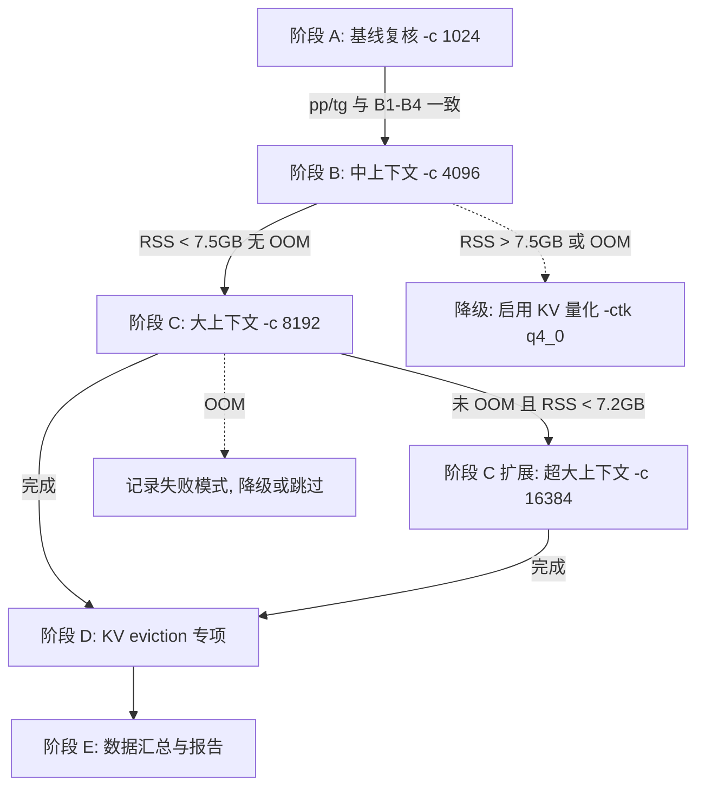

# RK3588 端侧 80B 大模型长上下文测试计划

- 日期：2026-08-07（起草）
- 项目负责人：欧阳易芃
- 目标设备：RK3588 开发板（Orange Pi 5 Plus，8GB RAM，型号 NBSXNXW23 2516）
- 文档性质：**实验计划（待执行）**，不含任何已执行命令或实测数据
- 关联文档：
  - [`RK3588-SLIMARC-80B性能分析.md`](RK3588-SLIMARC-80B性能分析.md)（性能分析，§7 下一步指引第 3 项为本计划核心依据）
  - [`RK3588-SLIMARC-80B测试报告-2026-08-06.md`](RK3588-SLIMARC-80B测试报告-2026-08-06.md)（短上下文基线数据来源）
  - [`RK3588-SLIMARC-80B实验计划.md`](RK3588-SLIMARC-80B实验计划.md)（首轮 80B 实验计划）

---

## 0. 背景与动机

### 0.1 已有结论回顾

2026-08-06 在 RK3588 端侧完成了 80B 模型（Qwen3-Next-80B-A3B Q4_K_M，45.09 GiB）短上下文（`-c 256`）测试，核心发现：

| 编号 | 配置 | pp (t/s) | tg (t/s) |
|:---:|:---|:---:|:---:|
| B1 | 基线默认（SLIM-ARC 全开） | 0.39 | 0.23 |
| B2 | `SLIM_ARC_DISABLE=1` | 2.02 | 0.89 |
| B3 | `SLIM_ARC_NO_MADV_RANDOM=1` | 1.41 | 0.65 |
| B4 | `SLIM_ARC_NO_PREFETCH=1` | 0.37 | 0.24 |
| B6 | t8 线程扩展 | 0.89 | 0.48 |

- TTFT ~121s，RSS 峰值 ~6.29-6.50 GiB（< 8GB，无 OOM）
- **短上下文下 SLIM-ARC 构成负优化**：B1 全开相比 B2 禁用，pp/tg 均慢约 5×
- 主因：MADV_RANDOM 静态全量设置关闭内核 readahead，破坏 prefill 顺序预读
- 预取在快 SSD + 短上下文下无增益（B1 ≈ B4）

### 0.2 性能分析给出的下一步指引

[`RK3588-SLIMARC-80B性能分析.md`](RK3588-SLIMARC-80B性能分析.md) §7 P1 第 3-4 项明确指出：

> **长生成 + 大上下文复测**：`llama-bench -n 128/256 -c 4096/8192`，对比 B1/B2，验证 decode 稳态下 MADV_RANDOM 是否有收益（短生成无法体现）。
>
> **验证预取稳态收益**：长生成场景下对比 B1（预取开）vs B4（预取关），寻找 decode 交叉点。

### 0.3 本次实验的核心定位

> **在长上下文（大 KV cache）场景下，SLIM-ARC 是否仍为负优化？还是内存压力出现后体现价值？**

短上下文测试的局限性在于：prefill 顺序访问占比极高、decode 步数太少（16-32 tokens），既放大了 MADV_RANDOM 对 prefill 的破坏，又掩盖了 decode 稳态下按需分页/预取的潜在收益。本次测试通过增大上下文（`-c 1024/4096/8192`）和生成长度（`-n 64/128/256`），让 KV cache 压力真实出现，观察 SLIM-ARC 的预取/KV eviction 机制是否在长生成稳态下体现价值。

### 0.4 铁律声明

> **本次实验纯粹是"运行参数"层面的测试（llama-cli/llama-bench 命令行参数 + 环境变量开关），不涉及任何源码、编译或补丁改动。不修改 src/、patches/、scripts/ 下任何文件。遵循 red-line：只做测试与留痕，不改机制。**

---

## 1. 实验目标

### 1.1 核心问题

| 编号 | 核心问题 | 验证方式 |
|:---:|:---|:---|
| Q1 | 长上下文（大 KV cache）场景下，SLIM-ARC 是否仍为负优化？还是内存压力出现后体现价值？ | 对比 B1（全开）vs B2（禁用）在 `-c 4096/8192` 下的 pp/tg/TTFT |
| Q2 | KV cache 压力是否触发 SLIM-ARC 的 KV eviction 机制？ | `SLIM_ARC_KV_EVICT=1` + 长 prompt，观察驱逐日志与 RSS 变化 |
| Q3 | 预取在长生成下是否出现"前期预取后期受益"的 decode 交叉点？ | 长生成 `-n 256` 下对比 B1（预取开）vs B4（预取关），观察 tg 是否随步数增加出现交叉 |
| Q4 | 大上下文下内存是否逼近 8GB 上限？是否 OOM/swap？ | 监控 RSS 峰值、swap si/so、pgmajfault |
| Q5 | MADV_RANDOM 的影响是否随上下文增大而变化？ | 对比 B1 vs B3 在 `-c 1024/4096/8192` 下的性能差距变化趋势 |

### 1.2 子目标详解

1. **KV cache 压力与 eviction 触发**（Q2）：短上下文测试中 KV eviction 未深度验证（"内存未紧张到需要逐 token 驱逐"）。本次通过大 `-c` + 长 prompt 增大 KV cache 占用，显式开启 `SLIM_ARC_KV_EVICT=1`，观察驱逐日志（`evicted [p0,p1)`）是否出现、驱逐频率、以及驱逐后 RSS 是否回落。

2. **预取稳态收益与 decode 交叉点**（Q3）：SLIM-ARC 预取的设计意图是"前期预取后期受益"——预取开销在前期，decode 稳态后命中率提升带来收益。短生成（16-32 tokens）无法体现。本次 `-n 256` 下 decode 需约 1000+ 步，足够观察 tg 是否随步数增加而改善（交叉点）。

3. **内存边界与 OOM 风险**（Q4）：大上下文 KV cache 叠加 45GB 权重 mmap 的 RSS，可能逼近 8GB 物理上限。需精确监控 RSS 峰值、swap 活动、major fault，记录是否 OOM。

4. **MADV_RANDOM 影响的趋势分析**（Q5）：短上下文下 MADV_RANDOM 是主要性能杀手（B1 vs B3 差 3.6×）。随上下文增大，prefill 占比下降、decode 占比上升，MADV_RANDOM 对 prefill 的破坏占比可能降低，而 decode 随机访问提示的潜在收益可能开始体现。需观察 B1/B3 比值随 `-c` 增大的变化。

---

## 2. 风险与可行性分析

### 2.1 KV cache 内存估算

#### 2.1.1 模型架构参数（来源：[`raw-80b-verbose.txt`](raw-80b-verbose.txt) GGUF metadata）

| 参数 | 值 | 说明 |
|:---|:---|:---|
| `block_count` | 48 | 总层数 |
| `attention.head_count` | 16 | 注意力头数 |
| `attention.head_count_kv` | 2 | KV 头数（GQA） |
| `attention.key_length` | 256 | 每头 key 维度 |
| `attention.value_length` | 256 | 每头 value 维度 |
| `embedding_length` | 2048 | 隐藏维度 |
| `ssm.state_size` | 128 | Mamba 状态维度 |
| `ssm.inner_size` | 4096 | Mamba 内部维度 |
| `ssm.group_count` | 16 | Mamba 分组数 |

> **重要**：Qwen3-Next-80B-A3B 是**混合注意力 + SSM（Mamba）架构**。48 层中部分为注意力层（KV cache 随上下文线性增长），部分为 SSM 层（状态固定大小，不随上下文增长）。因此 KV cache 实际增长仅来自注意力层。

#### 2.1.2 KV cache 估算公式

**注意力层 KV cache（随上下文线性增长）：**

```
KV_cache = context_len × n_attn_layers × 2 (K+V) × n_kv_heads × head_dim × bytes_per_element
```

其中：
- `n_attn_layers`：注意力层数（≤ 48，具体取决于混合比例）
- `n_kv_heads = 2`
- `head_dim = 256`（key_length = value_length = 256）
- `bytes_per_element`：f16 = 2 bytes；q4_0 ≈ 0.5 bytes

**SSM 层状态（固定大小，不随上下文增长）：**

```
SSM_state = n_ssm_layers × ssm_inner_size × ssm_state_size / ssm_group_count × bytes_per_element
```

#### 2.1.3 预计值

由于无法从 GGUF metadata 直接确定注意力层与 SSM 层的精确比例，给出两种估计：

**情况 A：全部 48 层均为注意力层（上界估计，最保守）**

| 上下文 | KV cache (f16) | KV cache (q4_0) | 叠加 RSS 6.3GB 后 |
|:---:|:---:|:---:|:---|
| 1024 | 96 MiB | 24 MiB | ~6.4 GB |
| 4096 | 384 MiB | 96 MiB | ~6.7 GB |
| 8192 | 768 MiB | 192 MiB | ~7.1 GB |
| 16384 | 1.50 GiB | 384 MiB | ~7.8 GB ⚠️ |

**情况 B：约 1/3 层为注意力层（16 层，混合架构典型比例）**

| 上下文 | KV cache (f16) | KV cache (q4_0) | 叠加 RSS 6.3GB 后 |
|:---:|:---:|:---:|:---|
| 1024 | 32 MiB | 8 MiB | ~6.3 GB |
| 4096 | 128 MiB | 32 MiB | ~6.4 GB |
| 8192 | 256 MiB | 64 MiB | ~6.6 GB |
| 16384 | 512 MiB | 128 MiB | ~6.8 GB |

> **结论**：在 f16 KV cache 下，`-c 8192` 的 KV cache 增量约 256-768 MiB，叠加 RSS 峰值 6.3GB 后约 6.6-7.1GB，仍 < 8GB 但余量收窄。`-c 16384` 在最保守估计下可能逼近 7.8GB，有 OOM 风险。若使用 `-ctk q4_0 -ctv q4_0` 量化 KV cache，内存压力大幅降低。

### 2.2 时间风险

80B decode 极慢（B1: 0.23 t/s，B2: 0.89 t/s），长生成耗时估算：

| 配置 | 生成长度 | B1 预计 decode 耗时 | B2 预计 decode 耗时 | 加 prefill 后单组总耗时 |
|:---:|:---:|:---:|:---:|:---|
| -c 4096, -n 128 | 128 tokens | ~557s (~9min) | ~144s (~2.4min) | B1: ~15-25min, B2: ~5-10min |
| -c 4096, -n 256 | 256 tokens | ~1113s (~19min) | ~288s (~5min) | B1: ~25-40min, B2: ~8-15min |
| -c 8192, -n 256 | 256 tokens | ~1113s (~19min) | ~288s (~5min) | B1: ~30-50min, B2: ~10-20min |

> prefill 阶段：`-c 4096` 的 prefill 需处理 4096 tokens，B1 pp 0.39 t/s 下需 ~10500s（~175min）——**这不可接受**。实际上 llama-bench 的 `-p` 参数控制 prefill 的 prompt 长度，`-c` 控制 context window（KV cache 预分配上限）。需区分：bench 模式下 `-p 4096` 才会 prefill 4096 tokens，而 `-c 4096` 仅分配 KV cache 空间。对于 llama-cli，实际 prefill 长度 = 输入 prompt 长度。

### 2.3 SSD 随机读风险

decode 阶段逐 token 随机访问 MoE 专家页（512 个专家中激活 10 个），45GB 文件中随机 4K 读的 IOPS 远低于顺序读带宽（2.1GB/s 是顺序读）。长生成 `-n 256` 下随机读次数显著增加，SSD 随机读性能可能成为 decode 瓶颈。

### 2.4 风险缓解措施

| 风险 | 缓解措施 |
|:---|:---|
| OOM | ① 每组设定 `timeout 3600`（60 分钟上限）；② 先小后大逐级增大上下文（1024→4096→8192→16384）；③ 优先测短生成 `-n 64` 确认不 OOM 再长生成；④ 可选启用 `-ctk q4_0 -ctv q4_0` 降低 KV cache 内存 |
| 时间过长 | ① B1（全开）长生成极慢，优先用 llama-bench（自动控制 prompt 长度）测 pp/tg；② llama-cli 长生成测试限制 `-n 256`，不测更长；③ 若单组超 60min timeout 则记录超时并降级 |
| swap 频繁 | 监控 vmstat si/so，若 si/so 持续 > 0 则记录为"内存压力触发 swap"，该组数据标注 swap 影响 |
| 无 root | 无法 drop_caches，每组测试前通过等待 + `sync` 尽量释放缓存；记录此限制 |

---

## 3. 测试矩阵

### 3.1 矩阵设计原则

1. **双工具覆盖**：llama-bench 测 pp/tg 吞吐（自动多次采样），llama-cli 测 TTFT/实际输出/RSS/swap（端到端）
2. **开关对比**：默认（SLIM-ARC 全开）/ DISABLE / NO_MADV_RANDOM / NO_PREFETCH / KV_EVICT，与短上下文 B1-B4 对齐
3. **逐级增大**：`-c 1024 → 4096 → 8192`，视时间与内存情况加 `-c 16384`
4. **线程**：t4 为主（与 B1 对齐），关键组加 t8
5. **生成长度**：`-n 64/128/256`，bench 模式 prompt 长度匹配上下文规模

### 3.2 核心测试矩阵

#### 阶段 A：小上下文基线复核（`-c 1024`）

| 编号 | 工具 | -c | -p/-n | -t | 环境变量 | 目的 | 预计耗时 |
|:---:|:---:|:---:|:---:|:---:|:---|:---|:---|
| LC1 | bench | 1024 | p512 n64 | 4 | 默认（全开） | 小上下文基线，校准与 B1 一致性 | ~10min |
| LC2 | bench | 1024 | p512 n64 | 4 | `SLIM_ARC_DISABLE=1` | 禁用对比基线 | ~5min |
| LC3 | bench | 1024 | p512 n64 | 4 | `SLIM_ARC_NO_MADV_RANDOM=1` | MADV_RANDOM 影响校准 | ~5min |
| LC4 | bench | 1024 | p512 n64 | 4 | `SLIM_ARC_NO_PREFETCH=1` | 预取影响校准 | ~10min |

> **准入条件**：LC1-LC4 的 pp/tg 应与短上下文 B1-B4 趋势一致（B1 < B3 < B2），确认环境无漂移后方可进入阶段 B。

#### 阶段 B：中上下文主对比矩阵（`-c 4096`）

| 编号 | 工具 | -c | -p/-n | -t | 环境变量 | 目的 | 预计耗时 |
|:---:|:---:|:---:|:---:|:---:|:---|:---|:---|
| LC5 | bench | 4096 | p512 n128 | 4 | 默认（全开） | 中上下文全开 pp/tg | ~20min |
| LC6 | bench | 4096 | p512 n128 | 4 | `SLIM_ARC_DISABLE=1` | 中上下文禁用对比 | ~8min |
| LC7 | bench | 4096 | p512 n128 | 4 | `SLIM_ARC_NO_MADV_RANDOM=1` | MADV_RANDOM 影响随上下文变化 | ~10min |
| LC8 | bench | 4096 | p512 n128 | 4 | `SLIM_ARC_NO_PREFETCH=1` | 预取影响随上下文变化 | ~20min |
| LC9 | bench | 4096 | p512 n128 | 8 | 默认（全开） | t8 线程扩展 | ~15min |
| LC10 | bench | 4096 | p512 n128 | 8 | `SLIM_ARC_DISABLE=1` | t8 禁用对比 | ~5min |
| LC11 | cli | 4096 | prompt~512 n128 | 4 | 默认（全开） | 端到端 TTFT/RSS/swap | ~25min |
| LC12 | cli | 4096 | prompt~512 n128 | 4 | `SLIM_ARC_DISABLE=1` | 端到端对比 | ~10min |
| LC13 | cli | 4096 | prompt~512 n128 | 4 | `SLIM_ARC_NO_MADV_RANDOM=1` | 端到端对比 | ~12min |

> **退出条件**：LC5-LC8 完成 pp/tg 对比，LC11-LC13 完成 TTFT/RSS 采集。若 LC11 RSS 峰值 > 7.5GB 或出现 OOM，则记录失败模式，跳过 LC12-LC13 直接进入阶段 C 的保守模式（降低 `-n` 或启用 KV 量化）。

#### 阶段 C：大上下文（`-c 8192`）

| 编号 | 工具 | -c | -p/-n | -t | 环境变量 | 目的 | 预计耗时 |
|:---:|:---:|:---:|:---:|:---:|:---|:---|:---|
| LC14 | bench | 8192 | p512 n128 | 4 | 默认（全开） | 大上下文全开 pp/tg | ~25min |
| LC15 | bench | 8192 | p512 n128 | 4 | `SLIM_ARC_DISABLE=1` | 大上下文禁用对比 | ~8min |
| LC16 | bench | 8192 | p512 n128 | 4 | `SLIM_ARC_NO_MADV_RANDOM=1` | MADV_RANDOM 影响趋势 | ~12min |
| LC17 | bench | 8192 | p512 n256 | 4 | 默认（全开） | 长生成 decode 稳态 | ~40min |
| LC18 | bench | 8192 | p512 n256 | 4 | `SLIM_ARC_NO_PREFETCH=1` | 预取交叉点验证 | ~40min |
| LC19 | cli | 8192 | prompt~1024 n256 | 4 | 默认（全开） | 大上下文端到端，OOM 边界 | ~50min |
| LC20 | cli | 8192 | prompt~1024 n256 | 4 | `SLIM_ARC_DISABLE=1` | 大上下文端到端对比 | ~15min |

> **准入条件**：阶段 B 全部完成且 LC11 RSS 峰值 < 7.5GB（有足够余量）。
> **退出条件**：LC14-LC15 完成 pp/tg 对比。若 LC19 OOM，则记录 OOM 模式（dmesg / 退出码 / RSS 截断值），跳过 LC20，改用 `-ctk q4_0 -ctv q4_0` 重试（LC19b）。

#### 阶段 C 扩展（可选）：超大上下文（`-c 16384`）

| 编号 | 工具 | -c | -p/-n | -t | 环境变量 | 目的 | 预计耗时 |
|:---:|:---:|:---:|:---:|:---:|:---|:---|:---|
| LC21 | bench | 16384 | p512 n128 | 4 | 默认（全开） | 超大上下文极限测试 | ~30min |
| LC22 | bench | 16384 | p512 n128 | 4 | `SLIM_ARC_DISABLE=1` | 超大上下文对比 | ~10min |
| LC23 | bench | 16384 | p512 n128 | 4 | 默认 + `-ctk q4_0 -ctv q4_0` | KV 量化降内存 | ~30min |

> **准入条件**：阶段 C LC19 未 OOM 且 RSS 峰值 < 7.2GB。若 LC19 已 OOM 或 RSS > 7.5GB，则 LC21-LC23 仅在启用 KV 量化后执行。

#### 阶段 D：KV eviction 专项

| 编号 | 工具 | -c | -p/-n | -t | 环境变量 | 目的 | 预计耗时 |
|:---:|:---:|:---:|:---:|:---:|:---|:---|:---|
| LC24 | cli | 8192 | prompt~2048 n256 | 4 | `SLIM_ARC_KV_EVICT=1` `SLIM_ARC_KV_SINK=4` `SLIM_ARC_KV_WINDOW=256` | KV eviction 触发与 RSS 回落 | ~50min |
| LC25 | cli | 8192 | prompt~2048 n256 | 4 | `SLIM_ARC_KV_EVICT=1` `SLIM_ARC_KV_SINK=4` `SLIM_ARC_KV_WINDOW=1024` | 宽窗口 eviction 对比 | ~50min |
| LC26 | cli | 8192 | prompt~2048 n256 | 4 | 默认（无 eviction） | eviction 基线对比 | ~50min |

> **目的**：对比 LC24/LC25（有 eviction）vs LC26（无 eviction），观察驱逐日志频率、RSS 峰值差异、以及 eviction 是否影响输出质量（文本连贯性）。
> **准入条件**：阶段 C 完成。LC24 的 `SLIM_ARC_KV_WINDOW=256` 意味着 KV cache 最多保留 4+256=260 tokens，长 prompt 2048 + 生成 256 会持续触发驱逐。

#### 阶段 E：数据汇总与报告

| 编号 | 活动 | 产出 |
|:---:|:---|:---|
| LC27 | 汇总所有 raw 日志数据到 `longctx-summary.txt` | 结构化数据表 |
| LC28 | 撰写测试报告 `RK3588-SLIMARC-80B长上下文测试报告-2026-08-07.md` | 完整报告 |

### 3.3 矩阵总览



---

## 4. 监控与指标

### 4.1 指标定义

| 指标 | 定义 | 采集方式 |
|:---|:---|:---|
| **pp** | prompt processing 吞吐量 (tokens/s) | llama-bench 自动输出 |
| **tg** | text generation 吞吐量 (tokens/s) | llama-bench 自动输出 |
| **TTFT** | Time To First Token，首 token 延迟 (s) | llama-cli 输出时间戳 / 手动计时 |
| **RSS 峰值** | 进程驻留物理内存峰值 (GiB) | [`monitor-peak-rss.sh`](monitor-peak-rss.sh) 采样 `/proc/<pid>/status` VmHWM |
| **swap si/so** | swap 换入/换出 (KB/s) | `vmstat 1` 采样 si/so 列 |
| **pgmajfault** | major page fault 增量 | 运行前后 `/proc/vmstat` 的 `pgmajfault` 差值 |
| **pgfault** | minor page fault 增量 | 运行前后 `/proc/vmstat` 的 `pgfault` 差值 |
| **OOM** | 是否发生 Out Of Memory | 进程退出码（137=OOM killed）+ `dmesg` 检查 |
| **KV eviction 日志** | 驱逐事件计数与频率 | stderr 中 `SLIM-ARC KV eviction: evicted` 行数统计 |
| **free -h 快照** | 系统内存使用 | 每组测试前后各执行一次 `free -h` |

### 4.2 监控流程（每组测试）

每组测试执行以下监控流程：

```
1. 测试前快照
   - free -h > raw-80b-lc-<编号>-pre-free.txt
   - cat /proc/vmstat | grep -E 'pgfault|pgmajfault' > raw-80b-lc-<编号>-pre-vmstat.txt
   - 记录 vmstat 基线

2. 启动后台监控
   - vmstat 1 > raw-80b-lc-<编号>-vmstat.txt &  (后台持续采样)
   - 启动 llama-cli/bench，同时 monitor-peak-rss.sh <pid> raw-80b-lc-<编号>-rss.txt &

3. 执行测试
   - llama-bench / llama-cli 命令，输出 tee 到 raw-80b-lc-<编号>.txt
   - 记录开始/结束时间戳

4. 测试后快照
   - free -h > raw-80b-lc-<编号>-post-free.txt
   - cat /proc/vmstat | grep -E 'pgfault|pgmajfault' > raw-80b-lc-<编号>-post-vmstat.txt
   - 计算 pgfault/pgmajfault 增量
   - kill 后台 vmstat 进程
   - dmesg | tail -20 > raw-80b-lc-<编号>-dmesg.txt (检查 OOM)
```

### 4.3 关键指标判读规则

| 指标 | 正常范围 | 警告 | 危险 |
|:---|:---|:---|:---|
| RSS 峰值 | < 7.0 GiB | 7.0-7.5 GiB | > 7.5 GiB（OOM 逼近） |
| swap si/so | 持续 0 | 偶发 > 0 | 持续 > 0（swap 活跃，性能受影响） |
| pgmajfault 增量 | < 1000 | 1000-10000 | > 10000（大量 SSD 缺页） |
| 退出码 | 0 | — | 137（OOM killed） |

---

## 5. 执行步骤（分阶段）

### 5.1 阶段 A：小上下文基线复核

**目标**：在 `-c 1024` 下复核 LC1-LC4，确认与短上下文 B1-B4 趋势一致，校准环境。

**执行步骤**：
1. 执行 LC1-LC4（llama-bench，`-c 1024 -p 512 -n 64 -t 4`，4 种开关配置）
2. 对比 LC1 vs LC2（全开 vs 禁用）、LC1 vs LC3（MADV_RANDOM）、LC1 vs LC4（预取）
3. 确认趋势：LC1 < LC3 < LC2（pp/tg），与 B1 < B3 < B2 一致

**准入条件**：环境就绪（模型文件可访问、llama-bench 可执行）
**退出条件**：LC1-LC4 全部 EXIT=0，趋势与 B1-B4 一致
**失败处理**：若趋势不一致，记录差异并分析原因（可能是 `-c 1024` vs `-c 256` 的上下文差异），不阻塞后续阶段

### 5.2 阶段 B：中上下文主对比矩阵

**目标**：在 `-c 4096` 下完成 LC5-LC13，获取中上下文下 SLIM-ARC 全开 vs 禁用的 pp/tg/TTFT/RSS 对比。

**执行步骤**：
1. 先执行 LC5-LC8（bench 矩阵，4 种开关），获取 pp/tg
2. 执行 LC9-LC10（t8 扩展），观察线程影响
3. 执行 LC11-LC13（cli 端到端），获取 TTFT/RSS/swap
4. 重点对比：LC5 vs LC6（全开 vs 禁用）—— pp/tg 差距是否比 B1 vs B2 缩小？

**准入条件**：阶段 A 退出条件满足
**退出条件**：LC5-LC8 pp/tg 采集完成，LC11 RSS 峰值已记录
**失败处理**：若 LC11 OOM → 记录失败模式，LC12-LC13 改用 `-ctk q4_0 -ctv q4_0` 降内存重试

### 5.3 阶段 C：大上下文

**目标**：在 `-c 8192` 下完成 LC14-LC20，获取大上下文下的性能与内存边界数据。

**执行步骤**：
1. 先执行 LC14-LC16（bench，3 种开关），获取 pp/tg
2. 执行 LC17-LC18（bench，`-n 256` 长生成），对比全开 vs 禁预取，寻找 decode 交叉点
3. 执行 LC19-LC20（cli 端到端），获取 TTFT/RSS/swap，确认 OOM 边界

**准入条件**：阶段 B 退出条件满足，且 LC11 RSS 峰值 < 7.5GB
**退出条件**：LC14-LC15 pp/tg 采集完成
**失败处理**：
- 若 LC19 OOM → 记录 OOM 模式（退出码/dmesg/RSS 截断值），跳过 LC20
- 若 LC17/LC18 超 60min timeout → 记录超时，降级为 `-n 128` 重试

### 5.4 阶段 C 扩展：超大上下文（`-c 16384`）

**目标**：在 `-c 16384` 下探索极限，验证 KV eviction 的必要性。

**执行步骤**：
1. 执行 LC21-LC22（bench，全开 vs 禁用）
2. 若 LC21 OOM，执行 LC23（KV 量化）

**准入条件**：阶段 C LC19 未 OOM 且 RSS 峰值 < 7.2GB
**退出条件**：LC21-LC22 完成（或 OOM 已记录）
**失败处理**：若 LC21 OOM → 仅执行 LC23（KV 量化），记录量化前后对比

### 5.5 阶段 D：KV eviction 专项

**目标**：验证 KV eviction 在大上下文长生成下是否触发、是否降低 RSS、是否影响输出质量。

**执行步骤**：
1. 执行 LC24（`KV_EVICT=1, WINDOW=256`）—— 窄窗口，频繁驱逐
2. 执行 LC25（`KV_EVICT=1, WINDOW=1024`）—— 宽窗口，少量驱逐
3. 执行 LC26（无 eviction）—— 基线对比
4. 对比三组的：RSS 峰值、驱逐日志频率、输出文本连贯性

**准入条件**：阶段 C 完成
**退出条件**：LC24-LC26 全部完成，驱逐日志已采集
**失败处理**：若 LC24 输出乱码/不连贯 → 记录为 eviction 质量影响，降低驱逐频率（增大 WINDOW）重试

### 5.6 阶段 E：数据汇总与报告

**执行步骤**：
1. 汇总所有 raw 日志数据到 `longctx-summary.txt`（结构化表格：编号/-c/-n/-t/开关/pp/tg/TTFT/RSS/swap/pgmajfault/EXIT）
2. 绘制趋势图：pp/tg 随 `-c` 变化曲线（B1 vs B2 vs B3 vs B4）
3. 撰写测试报告 `RK3588-SLIMARC-80B长上下文测试报告-2026-08-07.md`

---

## 6. 数据留痕

### 6.1 原始日志命名规范

沿用既有 `raw-80b-*` 命名规范，长上下文测试使用 `lc`（long-context）前缀：

| 文件 | 内容 |
|:---|:---|
| `raw-80b-lc-<编号>.txt` | 主输出日志（llama-bench/cli stdout+stderr） |
| `raw-80b-lc-<编号>-rss.txt` | RSS 峰值监控结果 |
| `raw-80b-lc-<编号>-vmstat.txt` | vmstat 持续采样 |
| `raw-80b-lc-<编号>-pre-free.txt` | 测试前 free -h 快照 |
| `raw-80b-lc-<编号>-post-free.txt` | 测试后 free -h 快照 |
| `raw-80b-lc-<编号>-pre-vmstat.txt` | 测试前 /proc/vmstat |
| `raw-80b-lc-<编号>-post-vmstat.txt` | 测试后 /proc/vmstat |
| `raw-80b-lc-<编号>-dmesg.txt` | 测试后 dmesg 尾部（OOM 检查） |

> 所有文件存放于 [`docs/rk3588_test_notes/`](.) 目录。

### 6.2 汇总文件

| 文件 | 内容 |
|:---|:---|
| `longctx-summary.txt` | 全部测试组的结构化数据汇总表 |
| `RK3588-SLIMARC-80B长上下文测试报告-2026-08-07.md` | 正式测试报告（本次只写计划，报告待执行后撰写） |

### 6.3 留痕要求

- 每组测试的原始日志必须完整保存，不得截断
- OOM/超时/异常退出必须记录退出码和 dmesg
- 每组测试前后均需 `free -h` + `/proc/vmstat` 快照
- 驱逐日志（`SLIM-ARC KV eviction: evicted` 行）需完整保留用于频率统计

---

## 7. 预期与验收

### 7.1 预期结果

| 假设 | 预期 | 依据 |
|:---|:---|:---|
| MADV_RANDOM 的 prefill 惩罚随上下文增大占比降低 | B1/B3 的 pp 差距可能缩小 | prefill 占总耗时比例下降 |
| decode 稳态下 MADV_RANDOM 可能有收益 | B1/B2 的 tg 差距可能缩小 | 长生成 decode 占比上升，随机访问提示减少 readahead 浪费 |
| 预取在长生成下可能出现交叉点 | LC17 vs LC18 的 tg 可能在某步数后交叉 | 预取前期开销、后期命中率提升 |
| KV eviction 降低 RSS 但可能影响输出质量 | LC24 RSS < LC26，但输出可能不连贯 | StreamingLLM 丢弃中间 token |
| 大上下文 OOM 风险 | `-c 8192` f16 KV 可能 RSS > 7GB | KV cache 估算 §2.1 |
| 也可能仍为负优化 | 若 MADV_RANDOM 的 prefill 惩罚仍占主导 | 短上下文分析结论的延续 |

### 7.2 验收标准

| 验收项 | 标准 |
|:---|:---|
| 核心问题回答 | 能明确回答"长上下文下 SLIM-ARC 是否仍负优化"，给出数据支撑 |
| 数据完整性 | pp/tg/TTFT/RSS/swap/pgmajfault/OOM 至少覆盖 LC1-LC15 |
| 趋势分析 | 给出 pp/tg 随 `-c` 增大的变化趋势（B1 vs B2 vs B3 vs B4） |
| 内存边界 | 明确 `-c 8192` 下是否 OOM、RSS 峰值、swap 是否触发 |
| KV eviction | LC24-LC26 有驱逐日志、RSS 对比、输出质量评估 |
| 留痕完整 | 所有 raw 日志、汇总文件、报告齐全 |

### 7.3 验收等级

- **S 级（完全成功）**：全部测试组 EXIT=0，完整数据采集，核心问题有明确结论
- **A 级（成功）**：核心矩阵 LC1-LC15 完成，大上下文 OOM 已记录但降级方案成功
- **B 级（部分成功）**：中上下文完成，大上下文因 OOM/超时未能完成，但失败模式已记录
- **C 级（失败）**：小上下文基线复核即出现环境问题，无法继续

---

## 8. 附录

### 8.1 环境变量速查

| 环境变量 | 作用 | 默认值 | 说明 |
|:---|:---|:---|:---|
| `SLIM_ARC_DISABLE=1` | 禁用所有 SLIM-ARC 优化 | 未设置=启用 | 完全回退到上游 llama.cpp 行为 |
| `SLIM_ARC_NO_MADV_RANDOM=1` | 不设 MADV_RANDOM | 未设置=启用 | 保留预取，仅禁用按需分页提示 |
| `SLIM_ARC_NO_PREFETCH=1` | 禁用预取调度器 | 未设置=启用 | 保留 MADV_RANDOM，仅禁用预取 |
| `SLIM_ARC_KV_EVICT=1` | 启用 StreamingLLM KV eviction | 未设置=禁用 | 显式开启 KV cache 驱逐 |
| `SLIM_ARC_KV_SINK=4` | attention sink token 数 | 4 | 永久保留的前 N 个 token |
| `SLIM_ARC_KV_WINDOW=1024` | KV 滑动窗口大小 | 1024 | 保留最近 W 个 token |
| `SLIM_ARC_DYNAMIC_MADV` | 启用 prefill/decode 动态 MADV 切换 | 未设置=禁用 | 预留接口，当前未实现 |

### 8.2 命令模板

#### 8.2.1 llama-bench 长上下文模板

```bash
# 基本模板
BIN=/home/orangepi/src/llama-upstream/build/bin/llama-bench
MODEL=/home/orangepi/ssd/models/Qwen3-Next-80B-A3B-Instruct-Q4_K_M.gguf
LOGDIR=/home/orangepi/SLIM-ARC/docs/rk3588_test_notes

# LC5: -c 4096, 默认全开
$BIN -m $MODEL -c 4096 -p 512 -n 128 -t 4 -r 1 2>&1 | tee $LOGDIR/raw-80b-lc-5.txt

# LC6: -c 4096, SLIM_ARC_DISABLE
SLIM_ARC_DISABLE=1 $BIN -m $MODEL -c 4096 -p 512 -n 128 -t 4 -r 1 2>&1 | tee $LOGDIR/raw-80b-lc-6.txt

# LC7: -c 4096, NO_MADV_RANDOM
SLIM_ARC_NO_MADV_RANDOM=1 $BIN -m $MODEL -c 4096 -p 512 -n 128 -t 4 -r 1 2>&1 | tee $LOGDIR/raw-80b-lc-7.txt

# LC8: -c 4096, NO_PREFETCH
SLIM_ARC_NO_PREFETCH=1 $BIN -m $MODEL -c 4096 -p 512 -n 128 -t 4 -r 1 2>&1 | tee $LOGDIR/raw-80b-lc-8.txt
```

#### 8.2.2 llama-cli 长上下文模板（含监控）

```bash
BIN=/home/orangepi/src/llama-upstream/build/bin/llama-cli
MODEL=/home/orangepi/ssd/models/Qwen3-Next-80B-A3B-Instruct-Q4_K_M.gguf
LOGDIR=/home/orangepi/SLIM-ARC/docs/rk3588_test_notes
MONITOR=$LOGDIR/monitor-peak-rss.sh

# LC11: -c 4096, 默认全开, 端到端
# 1. 测试前快照
free -h > $LOGDIR/raw-80b-lc-11-pre-free.txt
cat /proc/vmstat | grep -E 'pgfault|pgmajfault' > $LOGDIR/raw-80b-lc-11-pre-vmstat.txt

# 2. 启动后台监控
vmstat 1 > $LOGDIR/raw-80b-lc-11-vmstat.txt &
VMSTAT_PID=$!

# 3. 执行测试（timeout 3600 = 60min 上限）
timeout 3600 $BIN -m $MODEL -c 4096 -n 128 -t 4 \
  -p "Please write a detailed essay about the history of computing, covering the key milestones from the invention of the transistor to modern AI. Include at least three major eras and discuss their impact on society." \
  -st -no-cnv 2>&1 | tee $LOGDIR/raw-80b-lc-11.txt &
CLI_PID=$!

# 4. 启动 RSS 监控
$MONITOR $CLI_PID $LOGDIR/raw-80b-lc-11-rss.txt &

# 5. 等待完成
wait $CLI_PID
EXIT_CODE=$?

# 6. 测试后快照
kill $VMSTAT_PID 2>/dev/null
free -h > $LOGDIR/raw-80b-lc-11-post-free.txt
cat /proc/vmstat | grep -E 'pgfault|pgmajfault' > $LOGDIR/raw-80b-lc-11-post-vmstat.txt
dmesg | tail -20 > $LOGDIR/raw-80b-lc-11-dmesg.txt

echo "EXIT_CODE=$EXIT_CODE"
```

#### 8.2.3 KV eviction 专项模板

```bash
# LC24: KV eviction, 窄窗口
SLIM_ARC_KV_EVICT=1 SLIM_ARC_KV_SINK=4 SLIM_ARC_KV_WINDOW=256 \
  timeout 3600 $BIN -m $MODEL -c 8192 -n 256 -t 4 \
  -p "$(python3 -c 'print("The history of artificial intelligence spans several decades. " * 200)')" \
  -st -no-cnv 2>&1 | tee $LOGDIR/raw-80b-lc-24.txt

# 预期日志：SLIM-ARC KV eviction: ENABLED (sink=4, window=256)
# 预期驱逐：seq_len > 260 后逐 token 驱逐 evicted [4,5) ...
```

#### 8.2.4 KV cache 量化降内存模板

```bash
# LC23: -c 16384 + KV 量化
$BIN -m $MODEL -c 16384 -p 512 -n 128 -t 4 -ctk q4_0 -ctv q4_0 -r 1 \
  2>&1 | tee $LOGDIR/raw-80b-lc-23.txt
```

### 8.3 测试矩阵速查表

| 编号 | 阶段 | -c | -p/-n | -t | 开关 | 工具 |
|:---:|:---:|:---:|:---:|:---:|:---|:---:|
| LC1 | A | 1024 | 512/64 | 4 | 默认 | bench |
| LC2 | A | 1024 | 512/64 | 4 | DISABLE | bench |
| LC3 | A | 1024 | 512/64 | 4 | NO_MADV_RANDOM | bench |
| LC4 | A | 1024 | 512/64 | 4 | NO_PREFETCH | bench |
| LC5 | B | 4096 | 512/128 | 4 | 默认 | bench |
| LC6 | B | 4096 | 512/128 | 4 | DISABLE | bench |
| LC7 | B | 4096 | 512/128 | 4 | NO_MADV_RANDOM | bench |
| LC8 | B | 4096 | 512/128 | 4 | NO_PREFETCH | bench |
| LC9 | B | 4096 | 512/128 | 8 | 默认 | bench |
| LC10 | B | 4096 | 512/128 | 8 | DISABLE | bench |
| LC11 | B | 4096 | ~512/128 | 4 | 默认 | cli |
| LC12 | B | 4096 | ~512/128 | 4 | DISABLE | cli |
| LC13 | B | 4096 | ~512/128 | 4 | NO_MADV_RANDOM | cli |
| LC14 | C | 8192 | 512/128 | 4 | 默认 | bench |
| LC15 | C | 8192 | 512/128 | 4 | DISABLE | bench |
| LC16 | C | 8192 | 512/128 | 4 | NO_MADV_RANDOM | bench |
| LC17 | C | 8192 | 512/256 | 4 | 默认 | bench |
| LC18 | C | 8192 | 512/256 | 4 | NO_PREFETCH | bench |
| LC19 | C | 8192 | ~1024/256 | 4 | 默认 | cli |
| LC20 | C | 8192 | ~1024/256 | 4 | DISABLE | cli |
| LC21 | C+ | 16384 | 512/128 | 4 | 默认 | bench |
| LC22 | C+ | 16384 | 512/128 | 4 | DISABLE | bench |
| LC23 | C+ | 16384 | 512/128 | 4 | 默认 + KV q4_0 | bench |
| LC24 | D | 8192 | ~2048/256 | 4 | KV_EVICT W=256 | cli |
| LC25 | D | 8192 | ~2048/256 | 4 | KV_EVICT W=1024 | cli |
| LC26 | D | 8192 | ~2048/256 | 4 | 默认无 eviction | cli |

---

*本计划文档不含任何已执行命令或实测数据。所有数据引用自 2026-08-06 测试报告与性能分析文档。本次实验不涉及任何源码、编译或补丁改动——零代码修改。*
