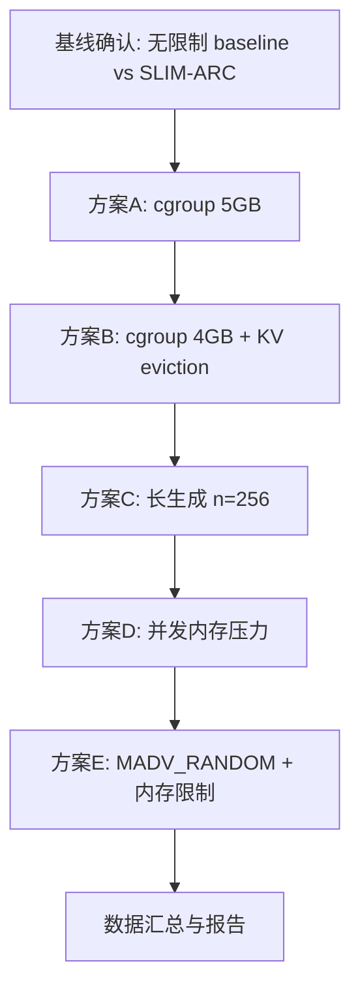

# RK3588 SLIM-ARC 优势场景测试计划

- 日期：2026-08-13
- 编写人：欧阳易芃
- 关联文档：
  - [`RK3588-SLIMARC-80B性能分析.md`](80B-长上下文测试归档/报告/RK3588-SLIMARC-80B性能分析.md)（根因分析）
  - [`RK3588-SLIMARC-80B长上下文测试报告-2026-08-07.md`](80B-长上下文测试归档/报告/RK3588-SLIMARC-80B长上下文测试报告-2026-08-07.md)（长上下文测试数据）

---

## 1. 背景与问题

### 1.1 当前状态

2026-08-07 动态 MADV 修复后，SLIM-ARC 在 RK3588 上与 baseline 性能持平（+8~9%，在噪声范围内）：

| 配置 | pp32 (t/s) | tg16 (t/s) | 备注 |
|:---|:---:|:---:|:---|
| Baseline (`SLIM_ARC_DISABLE=1`) | 2.51 | 1.31 | 纯 llama.cpp mmap |
| SLIM-ARC 默认 | 2.73 | 1.42 | prefetch hit_rate 仅 1.43% |

### 1.2 核心问题

> **SLIM-ARC 在 RK3588 上无法体现差异化优势，需要找到 SLIM-ARC 明显优于 baseline 的测试场景。**

### 1.3 根因分析（7 因素 → 2 主因）

| # | 因素 | 影响程度 | 说明 |
|:---:|:---|:---:|:---|
| 1 | 动态 MADV 默认 SEQUENTIAL | 高 | prefill+decode 均用 SEQUENTIAL，I/O 行为与 baseline 相同 |
| 2 | SSD 太快导致 prefetch 冗余 | 高 | 2.1GB/s 顺序读，内核 readahead 已覆盖，hit_rate 1.43% |
| 3 | **无内存压力** | **最高** | 6.4GB 可用，baseline 不 thrash/OOM，demand paging 优势无法体现 |
| 4 | KV eviction 未默认启用 | 中 | 需 `SLIM_ARC_KV_EVICT=1`，默认关闭 |
| 5 | 短生成无法体现 decode 优势 | 中 | 16 tokens 太短，prefetch 管线开销无法摊销 |
| 6 | 未测试慢 I/O 场景 | 中 | microSD 61.6 MB/s 可能放大 prefetch 收益 |
| 7 | 未测试并发内存压力 | 中 | 无其他进程竞争内存 |

**主因 1：无内存压力** — SLIM-ARC 核心设计是在内存受限下存活（x86 WSL +437% 来自 cgroup 硬限制）。RK3588 6.4GB 可用，baseline 也能跑。

**主因 2：SSD 太快** — prefetch hit_rate 1.43%，4168MB 浪费。慢 I/O 场景可能缩小 MADV_RANDOM 惩罚并放大 prefetch 收益。

### 1.4 铁律

1. 只做测试场景切换，**绝不修改核心代码/机制**
2. 所有测试记录输出到 `docs/rk3588_test_notes/`
3. 每个失败留痕并分析根因
4. 无终端交互，所有命令非交互

---

## 2. 环境信息

| 项 | 值 |
|:---|:---|
| 设备 | Orange Pi 5 Plus (RK3588) |
| 内存 | 7.8GiB 总 / 6.4GiB 可用 |
| Swap | 当前关闭（SwapTotal=0），zram0 3.9G 存在但未启用 |
| SSD | NVMe 953.9G，挂载 `/home/orangepi/ssd`，顺序读 ~2.1GB/s |
| microSD | mmcblk0 29.7G，挂载 `/`，顺序读 61.6 MB/s |
| cgroup v2 | 可用，memory controller 已委托到 user.slice |
| systemd-run | `systemd-run --user --scope -p MemoryMax=XG` 可用（无需 sudo） |
| 模型 | Qwen3-Next-80B-A3B-Instruct-Q4_K_M.gguf (45.09GiB) |
| 二进制 | `/home/orangepi/src/llama-upstream/build/bin/llama-bench` |

### 2.1 SLIM-ARC 环境变量速查

| 变量 | 默认 | 说明 |
|:---|:---|:---|
| `SLIM_ARC_DISABLE` | 未设(启用) | =1 完全禁用（baseline 模式） |
| `SLIM_ARC_DYNAMIC_MADV` | 未设(启用) | =0 禁用动态 MADV 切换 |
| `SLIM_ARC_DECODE_MADV` | SEQUENTIAL | decode 阶段 MADV 建议；=RANDOM/NORMAL 可覆盖 |
| `SLIM_ARC_NO_MADV_RANDOM` | 未设(启用) | =1 禁用 MADV_RANDOM |
| `SLIM_ARC_NO_PREFETCH` | 未设(启用) | =1 禁用 expert prefetch |
| `SLIM_ARC_KV_EVICT` | 未设(禁用) | =1 启用 KV eviction |
| `SLIM_ARC_KV_SINK` | 4 | KV eviction 保留的 sink tokens |
| `SLIM_ARC_KV_WINDOW` | 1024 | KV eviction 滑动窗口大小 |
| `SLIM_ARC_EXPERT_CONF` | 未设(禁用) | =1 启用专家置信度门控 |
| `SLIM_ARC_EXPERT_POP` | 未设 | =K 启用热门专家组合预取 |

---

## 3. 测试方案

### 3.1 方案 A：cgroup 5GB 内存限制

**假设**：限制进程内存到 5GB 后，baseline 因 mmap 顺序 readahead 加载过多页面导致内存压力增大（RSS 接近限制），SLIM-ARC 的 demand paging（MADV_RANDOM in decode）更精准地加载所需页面，减少内存浪费。

**测试矩阵**：

| 编号 | 配置 | MemoryMax | SLIM_ARC_DISABLE | SLIM_ARC_DECODE_MADV | 预期 |
|:---:|:---|:---:|:---:|:---|:---|
| A1 | Baseline 5GB | 5G | 1 | - | 可能 thrash 或慢 |
| A2 | SLIM-ARC 默认 5GB | 5G | - | SEQUENTIAL | 与 A1 类似 |
| A3 | SLIM-ARC RANDOM 5GB | 5G | - | RANDOM | 可能优于 A1（精准分页） |
| A4 | Baseline 无限制 | max | 1 | - | 对照组 |

**命令模板**：

```bash
# A1: Baseline + 5GB 限制
systemd-run --user --scope -p MemoryMax=5G \
  env SLIM_ARC_DISABLE=1 \
  /home/orangepi/src/llama-upstream/build/bin/llama-bench \
  -m /home/orangepi/ssd/models/Qwen3-Next-80B-A3B-Instruct-Q4_K_M.gguf \
  -p 128 -n 64 -t 4 -r 1 --no-warmup -ctk q4_0 -ctv q4_0

# A2: SLIM-ARC 默认 + 5GB 限制
systemd-run --user --scope -p MemoryMax=5G \
  /home/orangepi/src/llama-upstream/build/bin/llama-bench \
  -m /home/orangepi/ssd/models/Qwen3-Next-80B-A3B-Instruct-Q4_K_M.gguf \
  -p 128 -n 64 -t 4 -r 1 --no-warmup -ctk q4_0 -ctv q4_0

# A3: SLIM-ARC + DECODE_MADV=RANDOM + 5GB 限制
systemd-run --user --scope -p MemoryMax=5G \
  env SLIM_ARC_DECODE_MADV=RANDOM \
  /home/orangepi/src/llama-upstream/build/bin/llama-bench \
  -m /home/orangepi/ssd/models/Qwen3-Next-80B-A3B-Instruct-Q4_K_M.gguf \
  -p 128 -n 64 -t 4 -r 1 --no-warmup -ctk q4_0 -ctv q4_0
```

**指标**：pp t/s, tg t/s, 是否 OOM, RSS 峰值, major fault 数

---

### 3.2 方案 B：cgroup 4GB + KV eviction

**假设**：更严格的内存限制（4GB）下，baseline 大概率 OOM。SLIM-ARC 启用 KV eviction 后，通过 StreamingLLM 式滑动窗口驱逐旧 KV tokens，降低内存占用，可能存活。

**测试矩阵**：

| 编号 | 配置 | MemoryMax | KV_EVICT | 预期 |
|:---:|:---|:---:|:---:|:---|
| B1 | Baseline 4GB | 4G | - | 大概率 OOM |
| B2 | SLIM-ARC + KV eviction 4GB | 4G | 1 | 可能存活 |
| B3 | SLIM-ARC + KV eviction + RANDOM 4GB | 4G | 1+RANDOM | 最可能存活 |

**命令模板**：

```bash
# B1: Baseline + 4GB 限制
systemd-run --user --scope -p MemoryMax=4G \
  env SLIM_ARC_DISABLE=1 \
  /home/orangepi/src/llama-upstream/build/bin/llama-bench \
  -m /home/orangepi/ssd/models/Qwen3-Next-80B-A3B-Instruct-Q4_K_M.gguf \
  -p 128 -n 64 -t 4 -r 1 --no-warmup -ctk q4_0 -ctv q4_0

# B2: SLIM-ARC + KV eviction + 4GB 限制
systemd-run --user --scope -p MemoryMax=4G \
  env SLIM_ARC_KV_EVICT=1 SLIM_ARC_KV_SINK=4 SLIM_ARC_KV_WINDOW=512 \
  /home/orangepi/src/llama-upstream/build/bin/llama-bench \
  -m /home/orangepi/ssd/models/Qwen3-Next-80B-A3B-Instruct-Q4_K_M.gguf \
  -p 128 -n 64 -t 4 -r 1 --no-warmup -ctk q4_0 -ctv q4_0
```

**关键指标**：是否 OOM（存活即优势）、RSS 峰值、KV eviction 次数

---

### 3.3 方案 C：长生成 decode 稳态

**假设**：短生成（16 tokens）中 prefill 占比高，prefetch 开销无法摊销。长生成（256 tokens）中 decode 占比高，expert prefetch 可能在 decode 稳态显示收益。

**测试矩阵**：

| 编号 | 配置 | -n | 预期 |
|:---:|:---|:---:|:---|
| C1 | Baseline n=256 | 256 | 对照组 |
| C2 | SLIM-ARC 默认 n=256 | 256 | prefetch 可能有收益 |
| C3 | SLIM-ARC + EXPERT_CONF n=256 | 256 | 置信度门控可能提升 hit_rate |
| C4 | SLIM-ARC + EXPERT_POP n=256 | 256 | 热门专家预取可能提升 hit_rate |

**命令模板**：

```bash
# C1: Baseline 长生成
SLIM_ARC_DISABLE=1 \
  /home/orangepi/src/llama-upstream/build/bin/llama-bench \
  -m /home/orangepi/ssd/models/Qwen3-Next-80B-A3B-Instruct-Q4_K_M.gguf \
  -p 128 -n 256 -t 4 -r 1 --no-warmup -ctk q4_0 -ctv q4_0

# C2: SLIM-ARC 默认 长生成
/home/orangepi/src/llama-upstream/build/bin/llama-bench \
  -m /home/orangepi/ssd/models/Qwen3-Next-80B-A3B-Instruct-Q4_K_M&gguf \
  -p 128 -n 256 -t 4 -r 1 --no-warmup -ctk q4_0 -ctv q4_0
```

**指标**：tg t/s, prefetch hit_rate, prefetch issued/waste

---

### 3.4 方案 D：并发内存压力

**假设**：其他进程占用内存后，baseline 可用内存减少，mmap readahead 加载的页面可能被回收，导致更多 major fault。SLIM-ARC 的 demand paging 更精准，受影响更小。

**测试矩阵**：

| 编号 | 配置 | 内存压力 | 预期 |
|:---:|:---|:---:|:---|
| D1 | Baseline + 2GB 压力 | stress --vm 2 --vm-bytes 1G | 可用内存减少 |
| D2 | SLIM-ARC + 2GB 压力 | stress --vm 2 --vm-bytes 1G | 可能优于 D1 |
| D3 | Baseline + 3GB 压力 | stress --vm 3 --vm-bytes 1G | 可能 thrash |
| D4 | SLIM-ARC + 3GB 压力 | stress --vm 3 --vm-bytes 1G | 可能存活 |

**命令模板**：

```bash
# 启动内存压力
stress --vm 2 --vm-bytes 1G --timeout 600 &

# D1: Baseline + 内存压力
SLIM_ARC_DISABLE=1 \
  /home/orangepi/src/llama-upstream/build/bin/llama-bench \
  -m /home/orangepi/ssd/models/Qwen3-Next-80B-A3B-Instruct-Q4_K_M.gguf \
  -p 128 -n 64 -t 4 -r 1 --no-warmup -ctk q4_0 -ctv q4_0

# 清理
kill %1 2>/dev/null; wait 2>/dev/null
```

**指标**：pp/tg t/s, 可用内存, major fault, OOM

---

### 3.5 方案 E：MADV_RANDOM in decode + 内存限制

**假设**：在内存受限环境下，baseline 的顺序 readahead 会加载不需要的页面（浪费内存），MADV_RANDOM 只加载实际需要的页面，减少内存浪费，允许更多 KV cache 空间。

**测试矩阵**：

| 编号 | 配置 | MemoryMax | DECODE_MADV | 预期 |
|:---:|:---|:---:|:---|:---|
| E1 | Baseline 5.5GB | 5.5G | - | 对照组 |
| E2 | SLIM-ARC SEQUENTIAL 5.5GB | 5.5G | SEQUENTIAL | 与 E1 类似 |
| E3 | SLIM-ARC RANDOM 5.5GB | 5.5G | RANDOM | 精准分页，可能优于 E1 |
| E4 | SLIM-ARC NORMAL 5.5GB | 5.5G | NORMAL | 中间状态 |

**命令模板**：

```bash
# E3: SLIM-ARC + RANDOM + 5.5GB
systemd-run --user --scope -p MemoryMax=5500M \
  env SLIM_ARC_DECODE_MADV=RANDOM \
  /home/orangepi/src/llama-upstream/build/bin/llama-bench \
  -m /home/orangepi/ssd/models/Qwen3-Next-80B-A3B-Instruct-Q4_K_M.gguf \
  -p 128 -n 128 -t 4 -r 1 --no-warmup -ctk q4_0 -ctv q4_0
```

**指标**：pp/tg t/s, RSS, major fault, OOM

---

## 4. 测试执行顺序



**优先级**：A > B > E > D > C

理由：内存限制场景（A/B/E）最可能体现 SLIM-ARC 优势，长生成（C）次之，并发压力（D）最不可控。

---

## 5. 数据收集规范

### 5.1 每组测试记录

1. **测试前快照**：`free -h`, `cat /proc/vmstat | grep -E "pgmajfault|pgfault"`, `uptime`
2. **测试输出**：llama-bench 完整输出（含 SLIM-ARC-METRICS）
3. **测试后快照**：`free -h`, `cat /proc/vmstat | grep -E "pgmajfault|pgfault"`
4. **cgroup 内存统计**（如适用）：`cat /sys/fs/cgroup/.../memory.current`, `memory.peak`, `memory.events`

### 5.2 原始日志命名

```
adv-scenario-{A1|A2|...|E4}-{date}.txt
adv-scenario-{编号}-pre-free.txt
adv-scenario-{编号}-pre-vmstat.txt
adv-scenario-{编号}-post-free.txt
adv-scenario-{编号}-post-vmstat.txt
```

### 5.3 留痕要求

- 所有原始日志保存到 `docs/rk3588_test_notes/`
- 测试报告保存到 `docs/rk3588_test_notes/RK3588-SLIMARC-优势场景测试报告-2026-08-13.md`
- 每组测试记录：配置、结果、是否 OOM、与 baseline 对比

---

## 6. 成功标准

| 等级 | 标准 | 说明 |
|:---:|:---|:---|
| **S** | SLIM-ARC 存活且 baseline OOM | 最强优势：SLIM-ARC 能跑，baseline 不能 |
| **A** | SLIM-ARC 比 baseline 快 50%+ | 显著性能优势 |
| **B** | SLIM-ARC 比 baseline 快 20-50% | 明显性能优势 |
| **C** | SLIM-ARC 比 baseline 快 10-20% | 轻微优势，需更多数据确认 |
| **D** | SLIM-ARC ≈ baseline（±10%） | 无差异化优势 |

**目标**：至少找到一个 S/A/B 级场景。

---

## 7. 风险与缓解

| 风险 | 缓解 |
|:---|:---|
| cgroup MemoryMax 导致 OOM kill | 先用较大限制（6G→5G→4G）逐步逼近 |
| stress 进程影响后续测试 | 每组测试后确认 stress 已退出 |
| 80B 模型加载慢（~2min） | 每组测试间等待模型完全卸载（pkill + sleep） |
| SSD 缓存影响冷启动公平性 | 每组测试前 `echo 3 > /proc/sys/vm/drop_caches`（需 sudo）；或接受缓存状态一致 |

---

*本文档为测试计划，执行结果将记录在 `RK3588-SLIMARC-优势场景测试报告-2026-08-13.md`。*
